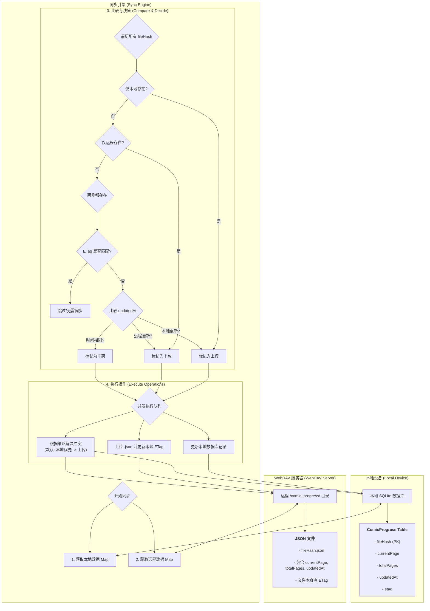

# Easy Comic - 您的专属漫画阅读器

[](https://opensource.org/licenses/MIT)
[](https://github.com/alice-easy/Easy-Comic/stargazers)
[](https://github.com/alice-easy/Easy-Comic/network/members)
[](https://github.com/alice-easy/Easy-Comic/issues)

<div align="center">


**一款为漫画爱好者打造的、注重隐私和数据主权的开源漫画阅读器**

[](https://flutter.dev)
[](https://dart.dev)
[](https://developer.android.com)
[](https://developer.apple.com/ios)
[](https://www.microsoft.com/windows)

</div>

**Easy Comic** 是一款基于 Flutter 构建的现代化漫画阅读器，致力于为用户提供卓越的阅读体验。它不仅支持本地漫画文件的流畅阅读，还通过 WebDAV 实现了安全的云端同步，让您的阅读数据完全掌握在自己手中。

## ✨ 功能亮点

### 📖 沉浸式阅读体验
- **多种阅读模式**: 支持单页/双页模式切换，水平翻页和垂直滚动阅读
- **智能手势控制**: 双指缩放、平移操作，提供流畅的图片浏览体验
- **多样翻页效果**: 拟物化、平移、淡入淡出等多种页面切换动画
- **全屏沉浸模式**: 隐藏状态栏和导航栏，专注于内容本身
- **缩略图导航**: 快速浏览页面缩略图，支持拖拽进度条精确定位

### 🎨 个性化定制
- **智能亮度控制**: 独立于系统的应用内亮度调节，支持自动调节和手动微调
- **Material 3 设计**: 现代化界面设计，支持动态颜色适配
- **多主题支持**: 护眼模式、夜间模式等多种预设背景主题
- **自适应布局**: 响应式设计，完美适配不同尺寸的设备屏幕

### 📊 智能进度管理
- **书签系统**: 添加、删除、快速跳转书签，永不丢失重要页面
- **阅读进度追踪**: 自动记录每本漫画的阅读位置和完成进度
- **阅读时长统计**: 详细记录阅读时间，生成每周阅读报告
- **收藏管理**: 标记喜爱的漫画，支持按收藏状态筛选和排序

### 🔄 强大的同步引擎
- **WebDAV 云同步**: 将阅读进度安全同步到您自己控制的服务器
- **智能冲突处理**: 采用 ETag 和时间戳机制，确保数据同步的准确性
- **后台自动同步**: 支持后台任务，无感知地保持数据最新状态
- **离线优先设计**: 本地存储优先，确保无网络时的流畅体验

### 🛠️ 强格式支持
- **漫画压缩包**: 直接读取 `.cbz`, `.zip` 格式，无需手动解压
- **图片格式**: 支持 `.jpg`, `.jpeg`, `.png`, `.gif`, `.webp` 等主流格式
- **智能排序**: 基于文件名自动排序，支持手动拖拽调整页面顺序
- **高效解析**: 在压缩包内直接读取，节省存储空间

### 📱 系统集成功能
- **桌面小组件**: Android 桌面小组件显示本周阅读统计
- **Firebase 集成**: 崩溃报告和使用分析，持续改进用户体验
- **多平台支持**: Android、iOS、Windows 全平台覆盖
- **原生性能**: 利用原生平台特性，提供最佳性能表现

## 🔄 同步逻辑 (How Sync Works)

为了让您更好地理解数据是如何在本地设备和您的 WebDAV 服务器之间流动的，我们绘制了以下的同步流程图。它展示了 `SyncEngine` 如何智能地比较数据并决定采取何种操作。



## 📁 支持的格式

- **漫画包格式**: `.cbz`, `.zip`
- **图片文件格式**: `.jpg`, `.jpeg`, `.png`, `.gif`, `.webp`

> **注意**: 目前暂不支持 `.cbr` (RAR 压缩) 格式。

## 🚀 开始使用

### 环境要求

- Flutter SDK: `^3.8.1`
- Dart SDK: `^3.8.1`
- Android: API 24+ (Android 7.0)
- iOS: iOS 12.0+
- Windows: Windows 10+

### 安装与运行

1.  **克隆仓库**
    ```sh
    git clone https://github.com/alice-easy/Easy-Comic.git
    cd Easy-Comic
    ```

2.  **安装依赖**
    ```sh
    flutter pub get
    ```

3.  **代码生成** (数据库相关)
    ```sh
    flutter packages pub run build_runner build --delete-conflicting-outputs
    ```

4.  **运行应用**
    ```sh
    flutter run
    ```

### 快速开始指南

1. **导入漫画**: 点击主页的"+"按钮，选择您的 CBZ 或 ZIP 漫画文件
2. **开始阅读**: 点击漫画封面开始阅读，支持手势缩放和翻页
3. **设置同步**: 在设置页面配置您的 WebDAV 服务器信息
4. **个性化**: 在阅读界面调整亮度、主题和阅读模式

## 🛠️ 开发

项目在 `scripts` 目录下提供了便捷的开发脚本：

- **`scripts/dev.bat`**: (Windows) 启动开发模式
- **`scripts/clean_and_build.bat`**: (Windows) 清理项目并重新构建

### 构建命令

```bash
# 开发运行
flutter run                    # 默认设备
flutter run -d windows         # Windows 桌面
flutter run -d android         # Android 设备

# 生产构建
flutter build apk              # Android APK
flutter build ios              # iOS 应用
flutter build windows          # Windows 桌面应用

# 代码检查
flutter analyze                # 静态代码分析
flutter test                   # 运行测试
```

## 🏗️ 技术架构

### 核心技术栈
- **UI 框架**: Flutter 3.8.1+
- **状态管理**: Riverpod
- **本地数据库**: Drift (SQLite)
- **网络同步**: WebDAV Client
- **图片显示**: PhotoView
- **后台任务**: WorkManager
- **分析统计**: Firebase Analytics & Crashlytics

### 项目结构
```
lib/
├── core/                      # 核心服务层
│   ├── comic_archive.dart        # 漫画档案处理
│   ├── sync_engine.dart          # 智能同步引擎
│   ├── brightness_service.dart   # 亮度控制服务
│   ├── webdav_service.dart       # WebDAV 客户端
│   ├── page_order_service.dart   # 页面排序服务
│   └── thumbnail_service.dart    # 缩略图服务
├── data/                      # 数据访问层
│   ├── drift_db.dart             # 数据库定义
│   └── *_repository.dart         # 数据仓库模式
├── home/                      # 主页模块
├── reader/                    # 阅读器模块
│   ├── widgets/                  # 阅读器组件
│   ├── mixins/                   # 功能混入
│   └── providers/                # 状态提供者
├── settings/                  # 设置模块
├── models/                    # 数据模型
└── services/                  # 业务服务
```

### 数据库设计
- **Comics**: 漫画文件元数据和收藏状态
- **ComicProgress**: 阅读进度和 WebDAV 同步信息
- **Bookmarks**: 书签管理系统
- **ReadingSessions**: 阅读时长统计
- **ReaderSettings**: 个性化阅读设置

## 🔐 隐私与安全

Easy Comic 致力于保护用户隐私和数据主权：

- **本地优先**: 所有漫画文件和核心数据存储在设备本地
- **可选同步**: WebDAV 同步完全可选，您完全控制数据去向
- **无用户追踪**: 除基本的崩溃报告外，不收集任何个人信息
- **开源透明**: 完全开源，代码逻辑完全透明可审计

## 🤝 贡献指南

我们欢迎任何形式的贡献！无论是 Bug 反馈、功能建议还是代码提交。

- **报告问题**: 如果您发现任何 Bug 或有好的建议，请通过 [Issues](https://github.com/alice-easy/Easy-Comic/issues) 告诉我们。
- **提交代码**:
  1. Fork 本仓库
  2. 创建您的特性分支 (`git checkout -b feature/AmazingFeature`)
  3. 提交您的更改 (`git commit -m 'Add some AmazingFeature'`)
  4. 推送到分支 (`git push origin feature/AmazingFeature`)
  5. 打开一个 Pull Request

### 代码规范
- 遵循 `flutter_lints` 代码规范
- 使用单引号字符串
- 为复杂逻辑添加清晰注释
- 确保代码通过 `flutter analyze` 静态检查

## 📦 主要依赖

本应用使用了以下优秀的开源库，感谢这些项目的开发者们！

- [`flutter_riverpod`](https://pub.dev/packages/flutter_riverpod): 现代化状态管理
- [`drift`](https://pub.dev/packages/drift): 类型安全的本地数据库
- [`webdav_client`](https://pub.dev/packages/webdav_client): WebDAV 协议实现
- [`photo_view`](https://pub.dev/packages/photo_view): 强大的图片查看与手势支持
- [`archive`](https://pub.dev/packages/archive): 高效的压缩包处理
- [`workmanager`](https://pub.dev/packages/workmanager): 跨平台后台任务
- [`dynamic_color`](https://pub.dev/packages/dynamic_color): Material 3 动态颜色
- [`home_widget`](https://pub.dev/packages/home_widget): 原生桌面小组件支持
- [`firebase_analytics`](https://pub.dev/packages/firebase_analytics): 应用分析统计
- [`firebase_crashlytics`](https://pub.dev/packages/firebase_crashlytics): 崩溃报告收集

## 📋 未来规划

- [ ] **多语言支持**: 国际化界面，支持更多语言
- [ ] **更多云存储**: 支持 OneDrive、Google Drive 等服务
- [ ] **阅读统计增强**: 更详细的数据可视化和分析
- [ ] **CBR 格式支持**: 扩展对 RAR 压缩格式的支持
- [ ] **社交功能**: 阅读记录分享和好友推荐系统

## 📄 许可证

本项目采用 [MIT 许可证](LICENSE)。

---

<div align="center">

**🌟 如果这个项目对您有帮助，请给我们一个 Star！**

Made with ❤️ for comic lovers everywhere

</div>