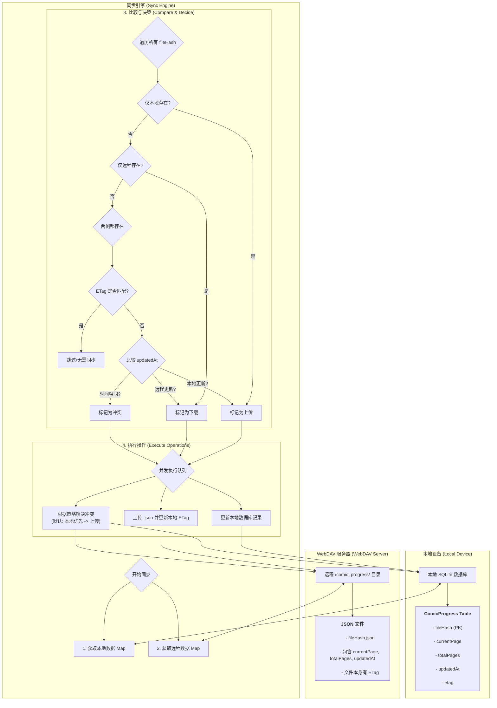

# Easy Comic - 您的专属漫画阅读器

[](https://opensource.org/licenses/MIT)
[](https://github.com/alice-easy/Easy-Comic/stargazers)
[](https://github.com/alice-easy/Easy-Comic/network/members)
[](https://github.com/alice-easy/Easy-Comic/issues)


**Easy Comic** 是一款为漫画爱好者打造的、注重隐私和数据主权的开源漫画阅读器。它基于 Flutter 构建，让您可以轻松地在设备上阅读本地漫画，并通过 WebDAV 将您的阅读进度安全地同步到您自己的服务器。

## ✨ 功能亮点

- **强大的格式支持**:
  - 直接读取常见的漫画压缩包格式，无需手动解压。
  - 在压缩包内自动识别并排序图片文件。

- **沉浸式阅读体验**:
  - 提供基于 `photo_view` 的流畅、可缩放的阅读界面。
  - 支持手势缩放、平移，专注于内容本身。
  - 记录每本漫画的阅读进度。

- **智能同步引擎**:
  - 通过 WebDAV 同步**阅读进度**而非整个漫画文件，极大地节省了网络流量和同步时间。
  - 采用智能比较机制（ETag 和时间戳），确保数据高效、准确地同步。
  - 支持并发同步，提升大规模数据处理能力。

- **数据归你所有**:
  - 您的所有阅读数据（进度、设置等）都存储在您自己控制的 WebDAV 服务器上，我们不收集任何用户信息。

- **跨平台设计**:
  - 基于 Flutter 构建，天然具备跨平台能力，未来可轻松扩展至桌面端和 Web 端。

## 📁 支持的格式

- **漫画包格式**: `.cbz`, `.zip`
- **图片文件格式**: `.jpg`, `.jpeg`, `.png`, `.gif`, `.webp`

> **注意**: 目前暂不支持 `.cbr` (RAR 压缩) 格式。

## 🔄 同步逻辑 (How Sync Works)

为了让您更好地理解数据是如何在本地设备和您的 WebDAV 服务器之间流动的，我们绘制了以下的同步流程图。它展示了 `SyncEngine` 如何智能地比较数据并决定采取何种操作。



## 🚀 开始使用

### 环境要求

- Flutter SDK: `^3.8.1`
- Dart SDK: `^3.8.1`

### 安装与运行

1.  **克隆仓库**
    ```sh
    git clone https://github.com/alice-easy/Easy-Comic.git
    cd Easy-Comic
    ```

2.  **安装依赖**
    ```sh
    flutter pub get
    ```

3.  **运行应用**
    ```sh
    flutter run
    ```

## 🛠️ 开发

项目在 `scripts` 目录下提供了一些便捷的开发脚本，以简化开发流程。

- **`scripts/dev.bat`**: (Windows) 启动开发模式。
- **`scripts/format.bat`**: (Windows) 格式化代码并进行静态分析。
- **`scripts/clean_and_build.bat`**: (Windows) 清理项目并重新构建。

如果项目包含需要代码生成的部分（例如 `drift`），请运行以下命令：

```bash
flutter packages pub run build_runner build --delete-conflicting-outputs
```

## 🤝 贡献指南

我们欢迎任何形式的贡献！无论是 Bug 反馈、功能建议还是代码提交。

- **报告问题**: 如果您发现任何 Bug 或有好的建议，请通过 [Issues](https://github.com/alice-easy/Easy-Comic/issues) 告诉我们。
- **提交代码**:
  1. Fork 本仓库。
  2. 创建您的特性分支 (`git checkout -b feature/AmazingFeature`)。
  3. 提交您的更改 (`git commit -m 'Add some AmazingFeature'`)。
  4. 推送到分支 (`git push origin feature/AmazingFeature`)。
  5. 打开一个 Pull Request。

## 📦 主要依赖

本应用使用了以下优秀的开源库，感谢这些项目的开发者们！

- [`flutter_riverpod`](https://pub.dev/packages/flutter_riverpod): 状态管理
- [`drift`](https://pub.dev/packages/drift): 本地数据库
- [`webdav_client`](https://pub.dev/packages/webdav_client): WebDAV 通信
- [`photo_view`](https://pub.dev/packages/photo_view): 图片查看与手势支持
- [`archive`](https://pub.dev/packages/archive): 压缩包处理
- [`workmanager`](https://pub.dev/packages/workmanager): 后台任务
- ... 以及其他优秀的库！

## 📄 许可证

本项目采用 [MIT 许可证](LICENSE)。
