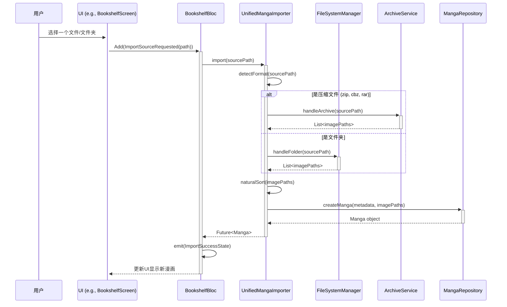
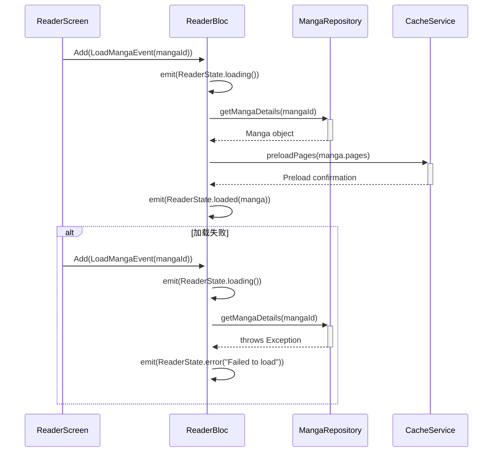
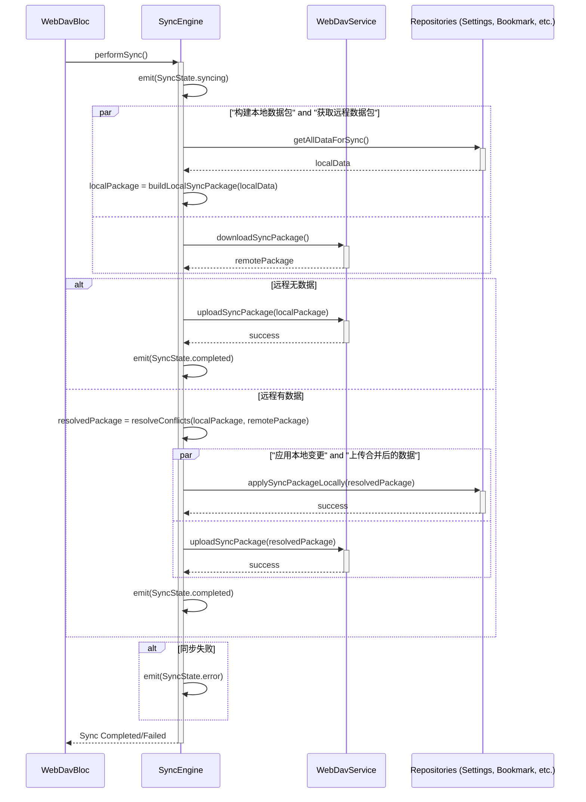

# Easy-Comic Flutter 应用架构蓝图

**版本:** 2.0
**日期:** 2025-08-02
**作者:** 架构师模式

## 1. 简介

本文档详细描述了 Easy-Comic Flutter 应用的系统架构。该架构基于**整洁架构 (Clean Architecture)** 原则，旨在实现高度的模块化、可测试性、可维护性和可扩展性。所有未来的开发工作都应遵循此蓝图。

### 1.1. 核心架构原则

*   **分层架构**: 严格遵守表示层、领域层和数据层的分离。
*   **依赖倒置**: 所有依赖关系都指向核心的领域层。
*   **单一职责**: 每个组件（BLoC, UseCase, Repository, Service）都有一个明确且单一的职责。
*   **面向接口编程**: 业务逻辑依赖于抽象接口，而非具体实现。

### 1.2. 技术选型

*   **状态管理**: `flutter_bloc` (BLoC)
*   **依赖注入**: `get_it`
*   **数据库**: `drift` (SQLite)
*   **网络/API**: `dio`
*   **数据模型**: `freezed`

---

## 2. 核心模块架构

### 2.1. 统一漫画导入器 (UnifiedMangaImporter)

**优先级:** 高
**位置:** `lib/core/importer/unified_manga_importer.dart`

#### 2.1.1. 模块概述

`UnifiedMangaImporter` 是一个核心服务，负责处理所有类型的漫画导入请求。它抽象了导入源的复杂性（如压缩文件、文件夹），并提供一个统一的接口来扫描、解析和创建一个标准的 `Manga` 实体。该服务位于**核心/服务层**，供上层（如 BLoC 或 UseCases）调用。

#### 2.1.2. 组件关系图 (Mermaid)

```mermaid
graph TD
    subgraph 表示层 (Presentation Layer)
        ReaderBloc
        BookshelfBloc
    end

    subgraph 领域层 (Domain Layer)
        A[ImportMangaUseCase]
        MangaRepository_Interface[MangaRepository (Interface)]
    end

    subgraph 数据层 (Data Layer)
        MangaRepository_Impl[MangaRepository (Implementation)]
    end

    subgraph 核心/服务层 (Core/Services)
        UMI(UnifiedMangaImporter)
        ArchiveService[ArchiveService]
        FileSystemManager[FileSystemManager]
        LoggingService[LoggingService]
    end

    ReaderBloc --> A
    BookshelfBloc --> A
    A --> UMI
    UMI --> ArchiveService
    UMI --> FileSystemManager
    UMI --> MangaRepository_Interface
    UMI --> LoggingService
    MangaRepository_Interface -- Implemented By --> MangaRepository_Impl
```

#### 2.1.3. 导入流程数据流图 (Mermaid)



#### 2.1.4. 核心类和职责

**`class UnifiedMangaImporter`**

*   `final ArchiveService archiveService;`: 依赖注入，用于处理压缩文件。
*   `final FileSystemManager fileManager;`: 依赖注入，用于处理文件系统操作。
*   `final MangaRepository mangaRepository;`: 依赖注入，用于将导入的漫画数据持久化到数据库。
*   `final LoggingService logger;`: 依赖注入，用于记录导入过程中的关键信息和错误。

*   `Future<Manga> import(String sourcePath)`:
    *   **入口方法**。
    *   调用 `detectFormat()` 来确定源类型（文件、文件夹、压缩包）。
    *   根据类型，委托给 `handleArchive()` 或 `handleFolder()`。
    *   获取图像列表后，调用 `naturalSort()` 进行自然排序。
    *   从路径中提取漫画标题。
    *   调用 `mangaRepository.createManga()` 创建并返回 `Manga` 实体。
    *   包含全面的 `try-catch` 块，并通过 `logger` 记录错误。

*   `ImportFormat detectFormat(String path)`:
    *   根据文件扩展名（.zip, .cbz, .rar）或路径属性（是否为目录）返回枚举 `ImportFormat` (`ARCHIVE`, `FOLDER`, `UNKNOWN`)。

*   `Future<List<String>> handleArchive(String filePath)`:
    *   调用 `archiveService.extract(filePath)` 来解压文件到临时目录。
    *   返回解压后的图像文件路径列表。

*   `Future<List<String>> handleFolder(String dirPath)`:
    *   调用 `fileManager.scanForImages(dirPath)` 递归扫描目录以查找支持的图像文件（.jpg, .png, .webp, .gif）。
    *   返回找到的图像文件路径列表。

*   `List<String> naturalSort(List<String> list)`:
    *   实现自然排序算法（例如，"page10.jpg" 在 "page2.jpg" 之后），以确保漫画页面顺序正确。

#### 2.1.5. 与现有架构的集成

*   **依赖注入**: `UnifiedMangaImporter` 将在 `injection_container.dart` 中注册为 `LazySingleton`。它所依赖的 `ArchiveService`、`FileSystemManager` 和 `LoggingService` 也将以同样的方式注册。

    ```dart
    // in injection_container.dart
    sl.registerLazySingleton(() => UnifiedMangaImporter(
      archiveService: sl(),
      fileManager: sl(),
      mangaRepository: sl(),
      logger: sl(),
    ));
    ```

*   **使用方式**: 任何需要导入功能的 BLoC（如 `BookshelfBloc`）或 UseCase（如 `ImportMangaUseCase`）都可以通过 `GetIt` (`sl<UnifiedMangaImporter>()`) 来获取其实例并调用 `import()` 方法。
---

### 2.2. 阅读器核心 (Reader)

**优先级:** 高
**位置:** `lib/presentation/features/reader/`

#### 2.2.1. 模块概述

`Reader` 模块是应用的核心用户体验所在。它负责展示漫画页面、处理用户交互（翻页、缩放），并管理阅读状态。该模块严格遵循 BLoC 模式，将 UI (`ReaderScreen`) 与业务逻辑 (`ReaderBloc`) 清晰地分离。

#### 2.2.2. 组件关系图 (Mermaid)

```mermaid
graph TD
    subgraph 表示层 (Presentation Layer)
        ReaderScreen
        ReaderBloc
        ReaderCoreUI[ReaderCore (UI Widget)]
    end

    subgraph 领域层 (Domain Layer)
        MangaRepository_Interface[MangaRepository (Interface)]
        SettingsRepository_Interface[SettingsRepository (Interface)]
    end
    
    subgraph 核心/服务层 (Core/Services)
        UMI(UnifiedMangaImporter)
        CacheService[CacheService]
    end

    ReaderScreen --> ReaderBloc
    ReaderScreen --> ReaderCoreUI
    ReaderBloc --> MangaRepository_Interface
    ReaderBloc --> SettingsRepository_Interface
    ReaderBloc --> UMI
    ReaderBloc --> CacheService
    ReaderCoreUI -- Displays Pages & Handles Gestures --> ReaderScreen
```

#### 2.2.3. BLoC 事件与状态流 (Mermaid)



#### 2.2.4. 核心类和职责

**`class ReaderScreen extends StatelessWidget`**

*   **职责**: 构建阅读器界面的根 Widget。
*   使用 `BlocProvider` 来创建和提供 `ReaderBloc` 实例。
*   使用 `BlocBuilder` 来监听 `ReaderBloc` 的状态变化，并根据不同的 `ReaderState` (`loading`, `loaded`, `error`) 构建相应的 UI。
*   将用户输入（如点击、滑动）转换为 `ReaderEvent` 并分发给 `ReaderBloc`。

**`class ReaderBloc extends Bloc<ReaderEvent, ReaderState>`**

*   **职责**: 包含所有与阅读器相关的业务逻辑。
*   `final UnifiedMangaImporter mangaImporter;`: 依赖注入，用于加载漫画数据。
*   `final MangaRepository mangaRepository;`: 依赖注入，用于获取漫画详情和更新阅读进度。
*   `final CacheService cacheService;`: 依赖注入，用于管理页面图像的缓存和预加载。
*   **事件处理**:
    *   `on<LoadMangaEvent>`:
        1.  发出 `ReaderState.loading()` 状态。
        2.  调用 `mangaRepository.getMangaDetails()` 获取漫画信息。
        3.  调用 `cacheService.preloadPages()` 预加载页面。
        4.  发出 `ReaderState.loaded()` 状态，并附带加载的漫画数据。
        5.  如果过程中发生错误，则发出 `ReaderState.error()` 状态。
    *   `on<PageChangedEvent>`: 更新状态中的当前页码，并通知 `mangaRepository` 保存阅读进度。
    *   `on<ToggleUIVisibilityEvent>`: 切换顶部和底部工具栏的可见性。

**`abstract class ReaderState` (使用 `freezed`)**

*   `const factory ReaderState.initial()`: 初始状态。
*   `const factory ReaderState.loading()`: 加载中状态。
*   `const factory ReaderState.loaded({required Manga manga, required int currentPage, required bool isUIVisible})`: 加载成功状态。
*   `const factory ReaderState.error({required String message})`: 错误状态。

**`abstract class ReaderEvent`**

*   `const factory ReaderEvent.loadManga({required String mangaId})`: 加载漫画事件。
*   `const factory ReaderEvent.pageChanged({required int newPage})`: 页面变更事件。
*   `const factory ReaderEvent.toggleUIVisibility()`: UI 可见性切换事件。

#### 2.2.5. 与现有架构的集成

*   **依赖注入**: `ReaderBloc` 将在 `injection_container.dart` 中注册为 `Factory`，因为它与特定的 UI 实例生命周期绑定。

    ```dart
    // in injection_container.dart
    sl.registerFactory(() => ReaderBloc(
      mangaImporter: sl(),
      mangaRepository: sl(),
      cacheService: sl(),
    ));
    ```

*   **UI 集成**: `ReaderScreen` 将通过 `BlocProvider` 在其 Widget 树中创建 `ReaderBloc` 的实例。子 Widget 可以通过 `context.read<ReaderBloc>()` 或 `BlocProvider.of<ReaderBloc>(context)` 来访问该实例。

    ```dart
    // in reader_screen.dart
    @override
    Widget build(BuildContext context) {
      return BlocProvider(
        create: (_) => sl<ReaderBloc>()..add(ReaderEvent.loadManga(mangaId: 'some-id')),
        child: BlocBuilder<ReaderBloc, ReaderState>(
          builder: (context, state) {
            return state.when(
              initial: () => const SizedBox.shrink(),
              loading: () => const Center(child: CircularProgressIndicator()),
              loaded: (manga, _, __) => ReaderCore(manga: manga),
              error: (message) => Center(child: Text(message)),
            );
          },
        ),
      );
    }
    ```
---

### 2.3. 设置中心 (Settings)

**优先级:** 中
**位置:** `lib/presentation/features/settings/`

#### 2.3.1. 模块概述

`Settings` 模块采用分层和模块化的架构，以应对其复杂性。它由一个主 `SettingsScreen` 聚合多个独立的 UI 组件（卡片/区域）组成，每个复杂的组件都由其自己的 BLoC 管理。这种方法将关注点分离，提高了可维护性和可扩展性。

*   **`SettingsBloc`**: 管理全局应用设置（如主题、阅读偏好）。
*   **`WebDavBloc`**: 专门管理 WebDAV 的状态、配置和认证流程。
*   **`AvatarManager`**: 一个独立的核心服务，负责处理用户头像的拾取、裁剪和缓存。

#### 2.3.2. 组件关系图 (Mermaid)

```mermaid
graph TD
    subgraph 表示层 (Presentation Layer)
        SettingsScreen
        UserProfileSection[UserProfileSection (Widget)]
        WebDavStatusCard[WebDavStatusCard (Widget)]
        
        SettingsBloc
        WebDavBloc
    end

    subgraph 领域层 (Domain Layer)
        SettingsRepository_Interface[SettingsRepository (Interface)]
    end
    
    subgraph 核心/服务层 (Core/Services)
        AvatarManager[AvatarManager]
        CacheService[CacheService]
        WebDavService[WebDavService]
    end

    subgraph 外部依赖
        ImagePicker[ImagePicker/Cropper]
    end

    SettingsScreen --> UserProfileSection
    SettingsScreen --> WebDavStatusCard
    
    SettingsScreen -- Provides --> SettingsBloc
    SettingsScreen -- Provides --> WebDavBloc

    UserProfileSection -- Reads State From & Dispatches Events To --> WebDavBloc
    UserProfileSection -- Calls --> AvatarManager
    WebDavStatusCard -- Reads State From & Dispatches Events To --> WebDavBloc

    SettingsBloc --> SettingsRepository_Interface
    WebDavBloc --> WebDavService
    WebDavBloc --> SettingsRepository_Interface

    AvatarManager --> ImagePicker
    AvatarManager --> CacheService
```

#### 2.3.3. 核心类和职责

**`class SettingsScreen extends StatelessWidget`**

*   **职责**: 作为设置页面的主容器。
*   使用 `MultiBlocProvider` 来提供 `SettingsBloc` 和 `WebDavBloc`，使其对所有子 Widget 可用。
*   组合了多个独立的设置区域 Widget，如 `UserProfileSection`、`WebDavStatusCard`、`ReadingPreferencesCard` 等。

**`class SettingsBloc extends Bloc<SettingsEvent, SettingsState>`**

*   **职责**: 管理通用的、非特定功能的应用程序设置。
*   处理 `UpdateSettingEvent` 等事件，调用 `SettingsRepository` 来持久化更改，并发出包含更新后 `AppSettings` 的新状态。

**`class WebDavBloc extends Bloc<WebDavEvent, WebDavState>`**

*   **职责**: 专门管理 WebDAV 功能的所有方面。
*   处理 `ConnectWebDavEvent`、`DisconnectWebDavEvent`、`SyncDataEvent` 等事件。
*   与 `WebDavService` 交互以执行网络操作。
*   与 `SettingsRepository` 交互以保存/读取 WebDAV 配置。
*   其状态 (`WebDavState`) 将包含连接状态、用户信息、上次同步时间等，供 `UserProfileSection` 和 `WebDavStatusCard` 等 Widget 使用。

**`class AvatarManager`**

*   **位置**: `lib/features/settings/avatar/avatar_manager.dart` (核心服务)
*   **职责**: 封装所有与用户头像相关的逻辑。
*   `final ImagePicker imagePicker;`: 依赖注入，用于从图库或相机选择图像。
*   `final ImageCropper imageCropper;`: 依赖注入，用于裁剪图像。
*   `final CacheService cacheService;`: 依赖注入，用于缓存裁剪后的头像以提高性能。
*   `Future<File> pickAndCropAvatar()`: 协调图像选择、裁剪和缓存的完整流程。

#### 2.3.4. 与现有架构的集成

*   **依赖注入**:
    *   `SettingsBloc` 和 `WebDavBloc` 将在 `injection_container.dart` 中注册为 `Factory`。
    *   `AvatarManager` 将注册为 `LazySingleton`，因为它是一个可重用的无状态服务。

    ```dart
    // in injection_container.dart
    sl.registerFactory(() => SettingsBloc(settingsRepository: sl()));
    sl.registerFactory(() => WebDavBloc(webDavService: sl(), settingsRepository: sl()));
    
    sl.registerLazySingleton(() => AvatarManager(
      imagePicker: sl(),
      imageCropper: sl(),
      cacheService: sl(),
    ));
    // 假设 imagePicker 和 imageCropper 实例也被注册
    ```

*   **UI 集成**: `SettingsScreen` 将使用 `MultiBlocProvider` 来创建和提供 BLoC 实例。

    ```dart
    // in settings_screen.dart
    @override
    Widget build(BuildContext context) {
      return MultiBlocProvider(
        providers: [
          BlocProvider(create: (_) => sl<SettingsBloc>()..add(LoadSettingsEvent())),
          BlocProvider(create: (_) => sl<WebDavBloc>()..add(CheckWebDavStatusEvent())),
        ],
        child: Scaffold(
          // ... body with UserProfileSection, WebDavStatusCard, etc.
        ),
      );
    }
    ```
---

### 2.4. 同步引擎 (SyncEngine)

**优先级:** 中
**位置:** `lib/core/sync/sync_engine.dart`

#### 2.4.1. 模块概述

`SyncEngine` 是一个复杂的核心服务，负责编排应用数据与远程 WebDAV 服务器之间的双向同步。它是一个无状态的协调器，被 `WebDavBloc` 触发，以执行完整的同步生命周期：打包本地数据、与远程数据比较、解决冲突和应用最终结果。它位于**核心/服务层**。

#### 2.4.2. 组件关系图 (Mermaid)

```mermaid
graph TD
    subgraph 表示层 (Presentation Layer)
        WebDavBloc
    end

    subgraph 领域层 (Domain Layer)
        SettingsRepo_Interface[SettingsRepository (Interface)]
        BookmarkRepo_Interface[BookmarkRepository (Interface)]
        ProgressRepo_Interface[ProgressRepository (Interface)]
    end
    
    subgraph 核心/服务层 (Core/Services)
        SyncEngine
        WebDavService[WebDavService]
    end

    WebDavBloc -- Triggers Sync --> SyncEngine
    
    SyncEngine --> WebDavService
    SyncEngine --> SettingsRepo_Interface
    SyncEngine --> BookmarkRepo_Interface
    SyncEngine --> ProgressRepo_Interface
```

#### 2.4.3. 同步流程 (`performSync`) 序列图 (Mermaid)



#### 2.4.4. 核心类和职责

**`class SyncEngine`**

*   `final WebDavService webDavService;`: 依赖注入，用于处理与 WebDAV 服务器的底层通信。
*   `final SettingsRepository settingsRepo;`: 依赖注入，用于读/写设置数据。
*   `final BookmarkRepository bookmarkRepo;`: 依赖注入，用于读/写书签数据。
*   `final ProgressRepository progressRepo;`: 依赖注入，用于读/写阅读进度数据。

*   `Future<void> performSync()`:
    *   **入口方法**，协调整个同步过程。
    *   并行执行 `buildLocalSyncPackage()` 和 `webDavService.downloadSyncPackage()`。
    *   调用 `resolveConflicts()` 来合并本地和远程数据。
    *   调用 `applySyncPackageLocally()` 将合并后的数据保存到本地仓库。
    *   调用 `webDavService.uploadSyncPackage()` 将合并后的数据上传到服务器。
    *   包含详细的错误处理和状态报告。

*   `Future<SyncPackage> buildLocalSyncPackage()`:
    *   从所有相关的仓库（`settingsRepo`, `bookmarkRepo`, `progressRepo` 等）收集需要同步的数据。
    *   将收集到的数据组装成一个 `SyncPackage` 对象并返回。

*   `Future<void> applySyncPackageLocally(SyncPackage package)`:
    *   将 `SyncPackage` 中的数据分发并保存到相应的本地仓库。

*   `SyncPackage resolveConflicts(SyncPackage local, SyncPackage remote)`:
    *   **核心冲突解决逻辑**。
    *   默认策略是“**以新为准**”：比较 `local.timestamp` 和 `remote.timestamp`。
    *   对于每个数据项（如 `AppSettings`），如果时间戳不同，则选择时间戳较新的版本。
    *   返回一个包含了所有最新数据的、合并后的 `SyncPackage`。

**`class SyncPackage`**

*   **位置**: `lib/models/sync_package.dart`
*   **职责**: 一个数据传输对象 (DTO)，用于封装所有需要同步的数据。
*   `final DateTime timestamp;`: 数据包的生成时间戳，用于冲突解决。
*   `final AppSettings settings;`: 应用设置。
*   `final List<Bookmark> bookmarks;`: 书签列表。
*   `final List<ComicProgress> progress;`: 阅读进度列表。
*   包含 `toJson()` 和 `fromJson()` 方法，以便序列化为 JSON 进行网络传输。

#### 2.4.5. 与现有架构的集成

*   **依赖注入**: `SyncEngine` 将在 `injection_container.dart` 中注册为 `LazySingleton`。

    ```dart
    // in injection_container.dart
    sl.registerLazySingleton(() => SyncEngine(
      webDavService: sl(),
      settingsRepo: sl(),
      bookmarkRepo: sl(),
      progressRepo: sl(),
    ));
    ```

*   **使用方式**: `WebDavBloc` 将在其事件处理器（如 `on<SyncDataEvent>`）中调用 `SyncEngine`。

    ```dart
    // in webdav_bloc.dart
    on<SyncDataEvent>((event, emit) async {
      emit(WebDavState.syncing());
      try {
        await sl<SyncEngine>().performSync();
        emit(WebDavState.connected(lastSync: DateTime.now()));
      } catch (e) {
        emit(WebDavState.error("Sync failed: $e"));
      }
    });
    ```