# Easy-Comic Flutter漫画阅读器 - 最终架构蓝图

## 项目概述

Easy-Comic是一个基于Flutter的跨平台漫画阅读器应用，提供流畅的阅读体验、智能缓存管理和丰富的个性化功能。

### 核心功能模块
- 📚 **漫画管理**: 导入、分类、搜索本地漫画文件
- 📖 **阅读器**: 多种阅读模式、手势控制、缩放功能
- 🔖 **书签系统**: 智能书签管理、阅读进度跟踪
- ⚙️ **设置系统**: 个性化阅读体验配置
- 🎨 **主题系统**: 多样化视觉主题选择
- 🚀 **性能优化**: 智能缓存、内存管理、预加载

## 技术栈架构

### 核心框架
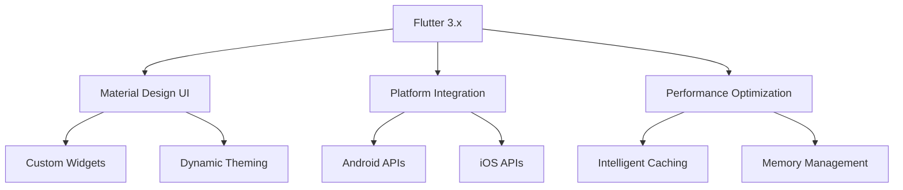

### 依赖管理
- **状态管理**: `flutter_bloc ^8.x` - 事件驱动的状态管理
- **数据持久化**: `drift ^2.x` - 类型安全的SQLite ORM
- **依赖注入**: `get_it ^7.x` - 服务定位器模式
- **图像处理**: `cached_network_image`, `photo_view` - 高性能图像显示
- **文档解析**: `archive ^3.x` - ZIP/RAR压缩包支持
- **平台集成**: `path_provider`, `permission_handler` - 文件系统访问

## 系统整体架构

### 三层架构设计
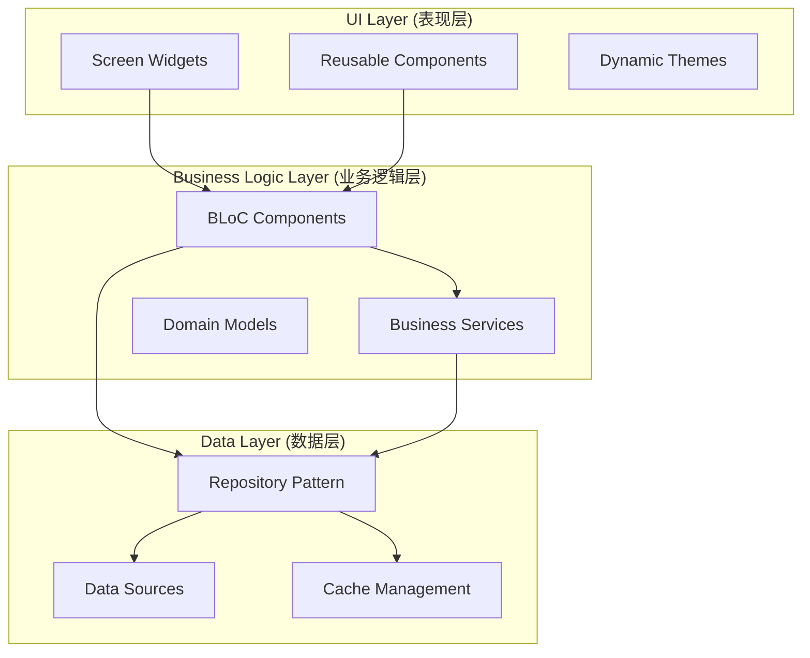

### 依赖注入架构
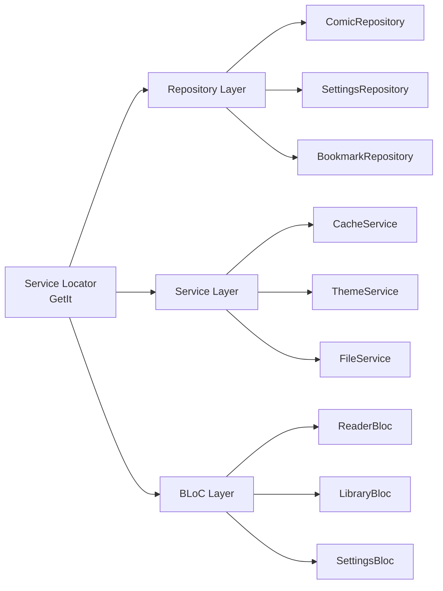

## 核心组件架构

### ReaderBloc状态管理
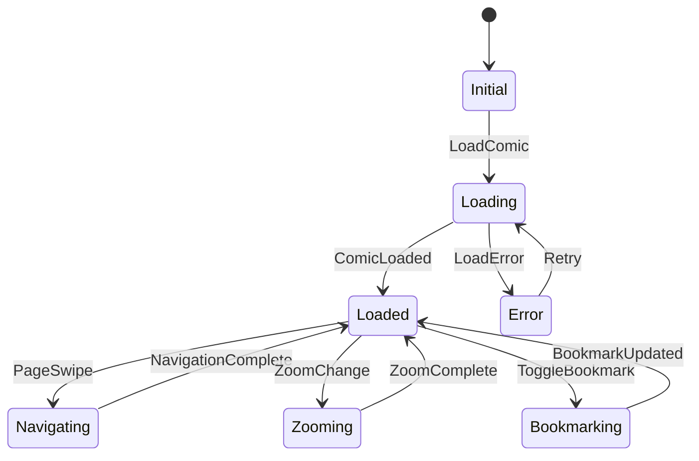

### Repository模式实现
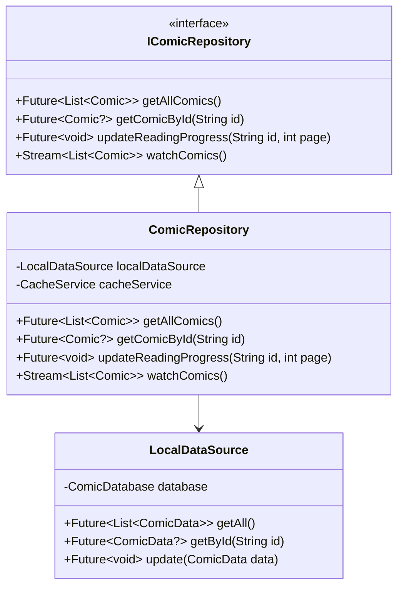

## 智能缓存架构

### 多级缓存系统
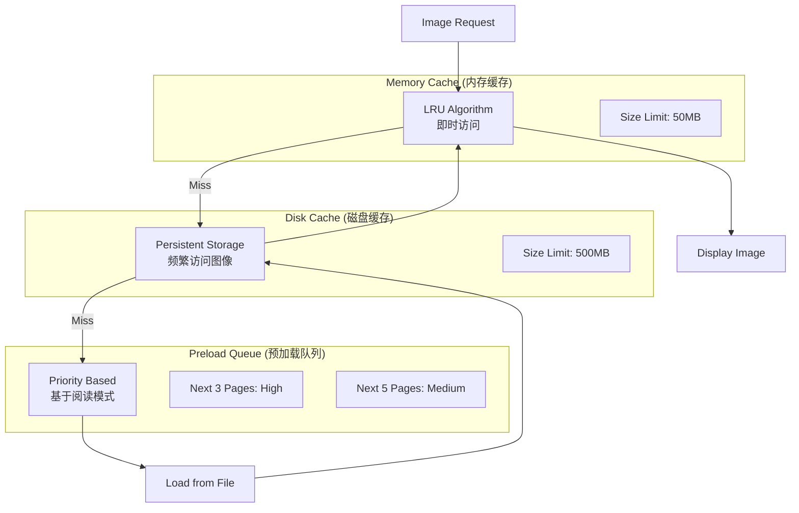

### 内存压力监控
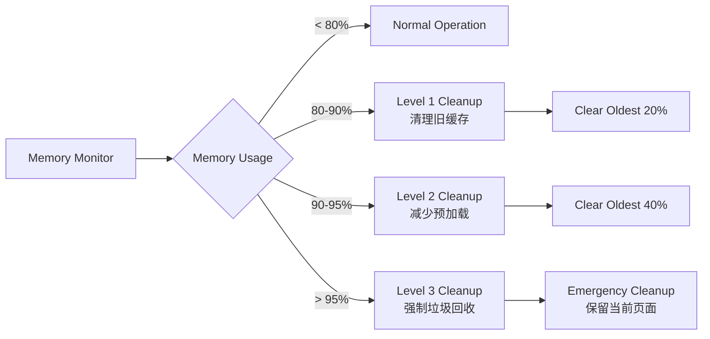

## 数据流架构

### 事件驱动数据流
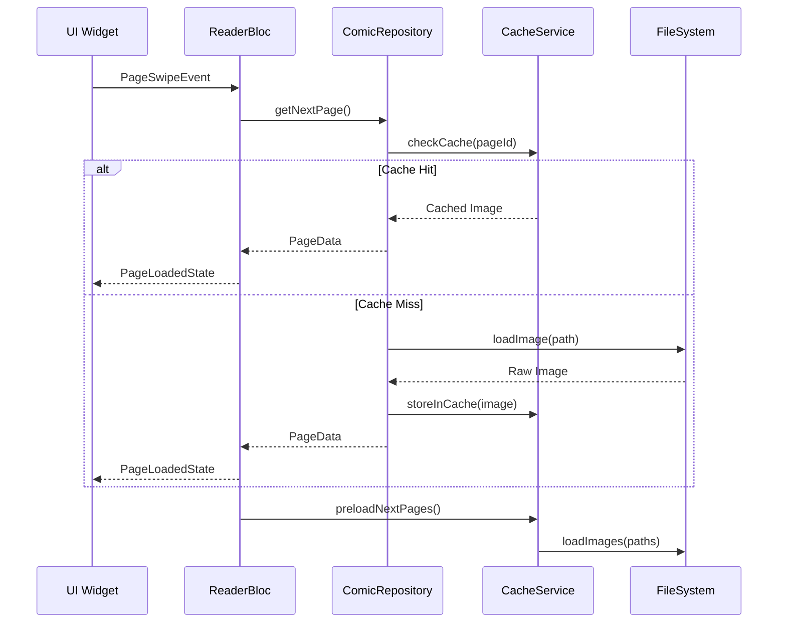

## 性能优化架构

### 图像优化策略
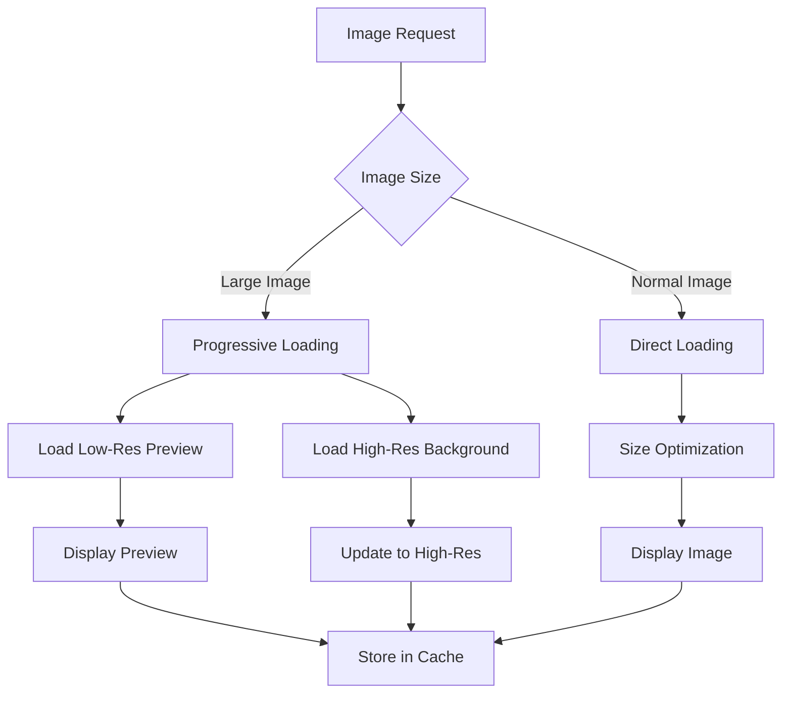

### 渲染优化
- **Viewport管理**: 只渲染可见区域±2页内容
- **Widget复用**: 使用ListView.builder减少Widget创建
- **异步加载**: 图像解码在隔离线程进行
- **内存池**: 复用Bitmap对象减少GC压力

## 平台适配架构

### 抽象服务接口
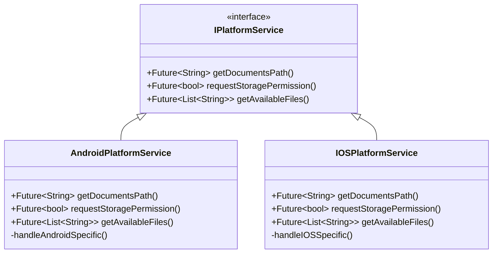

### 平台特定实现
- **Android**: 
  - 文件系统访问: MediaStore API + SAF
  - 权限管理: 动态权限请求
  - 手势处理: Android特定手势识别
- **iOS**: 
  - 文件系统访问: Document Picker
  - 权限管理: Info.plist配置
  - 手势处理: iOS手势识别器

## Flutter项目结构

```
lib/
├── core/                          # 核心功能模块
│   ├── constants/                 # 常量定义
│   ├── error/                     # 错误处理
│   ├── network/                   # 网络配置
│   ├── platform/                  # 平台适配
│   └── utils/                     # 工具函数
├── data/                          # 数据层
│   ├── datasources/              # 数据源
│   │   ├── local/                # 本地数据源
│   │   └── remote/               # 远程数据源
│   ├── models/                   # 数据模型
│   └── repositories/             # Repository实现
├── domain/                        # 业务领域层
│   ├── entities/                 # 领域实体
│   ├── repositories/             # Repository接口
│   └── usecases/                 # 用例
├── presentation/                  # 表现层
│   ├── bloc/                     # BLoC状态管理
│   ├── pages/                    # 页面
│   ├── widgets/                  # 可复用组件
│   └── theme/                    # 主题配置
└── injection_container.dart       # 依赖注入配置
```

## 关键模式与实践

### 1. BLoC模式实现
```dart
// Event定义
abstract class ReaderEvent extends Equatable {}

class LoadComicEvent extends ReaderEvent {
  final String comicId;
  LoadComicEvent(this.comicId);
}

class PageSwipeEvent extends ReaderEvent {
  final SwipeDirection direction;
  PageSwipeEvent(this.direction);
}

// State定义
abstract class ReaderState extends Equatable {}

class ReaderLoadingState extends ReaderState {}

class ReaderLoadedState extends ReaderState {
  final Comic comic;
  final int currentPage;
  final List<String> bookmarks;
  
  ReaderLoadedState({
    required this.comic,
    required this.currentPage,
    required this.bookmarks,
  });
}

// BLoC实现
class ReaderBloc extends Bloc<ReaderEvent, ReaderState> {
  final ComicRepository _comicRepository;
  final CacheService _cacheService;
  
  ReaderBloc({
    required ComicRepository comicRepository,
    required CacheService cacheService,
  }) : _comicRepository = comicRepository,
       _cacheService = cacheService,
       super(ReaderInitialState()) {
    
    on<LoadComicEvent>(_onLoadComic);
    on<PageSwipeEvent>(_onPageSwipe);
  }
  
  Future<void> _onLoadComic(
    LoadComicEvent event,
    Emitter<ReaderState> emit,
  ) async {
    emit(ReaderLoadingState());
    try {
      final comic = await _comicRepository.getComicById(event.comicId);
      if (comic != null) {
        await _cacheService.preloadPages(comic, 0, 3);
        emit(ReaderLoadedState(
          comic: comic,
          currentPage: 0,
          bookmarks: comic.bookmarks,
        ));
      }
    } catch (e) {
      emit(ReaderErrorState(e.toString()));
    }
  }
}
```

### 2. Repository模式实现
```dart
abstract class IComicRepository {
  Future<List<Comic>> getAllComics();
  Future<Comic?> getComicById(String id);
  Future<void> updateReadingProgress(String id, int page);
  Stream<List<Comic>> watchComics();
}

class ComicRepository implements IComicRepository {
  final LocalDataSource _localDataSource;
  final CacheService _cacheService;
  
  ComicRepository({
    required LocalDataSource localDataSource,
    required CacheService cacheService,
  }) : _localDataSource = localDataSource,
       _cacheService = cacheService;
  
  @override
  Future<List<Comic>> getAllComics() async {
    final cachedComics = await _cacheService.getCachedComics();
    if (cachedComics.isNotEmpty) {
      return cachedComics;
    }
    
    final comicDataList = await _localDataSource.getAllComics();
    final comics = comicDataList.map((data) => data.toEntity()).toList();
    
    await _cacheService.cacheComics(comics);
    return comics;
  }
  
  @override
  Future<Comic?> getComicById(String id) async {
    final cachedComic = await _cacheService.getCachedComic(id);
    if (cachedComic != null) {
      return cachedComic;
    }
    
    final comicData = await _localDataSource.getComicById(id);
    if (comicData != null) {
      final comic = comicData.toEntity();
      await _cacheService.cacheComic(comic);
      return comic;
    }
    
    return null;
  }
}
```

### 3. 智能缓存服务
```dart
class CacheService {
  final Map<String, Uint8List> _memoryCache = {};
  final Directory _diskCacheDir;
  final Queue<String> _lruQueue = Queue<String>();
  
  static const int maxMemoryCacheSize = 50 * 1024 * 1024; // 50MB
  static const int maxDiskCacheSize = 500 * 1024 * 1024; // 500MB
  
  Future<Uint8List?> getImage(String imageId) async {
    // 1. Check memory cache
    if (_memoryCache.containsKey(imageId)) {
      _updateLRU(imageId);
      return _memoryCache[imageId];
    }
    
    // 2. Check disk cache
    final diskFile = File('${_diskCacheDir.path}/$imageId');
    if (await diskFile.exists()) {
      final bytes = await diskFile.readAsBytes();
      _storeInMemoryCache(imageId, bytes);
      return bytes;
    }
    
    return null;
  }
  
  Future<void> preloadPages(Comic comic, int startPage, int count) async {
    final preloadQueue = PriorityQueue<PreloadTask>();
    
    // High priority: next 3 pages
    for (int i = startPage + 1; i <= startPage + 3 && i < comic.pages.length; i++) {
      preloadQueue.add(PreloadTask(comic.pages[i], Priority.high));
    }
    
    // Medium priority: next 5 pages
    for (int i = startPage + 4; i <= startPage + 8 && i < comic.pages.length; i++) {
      preloadQueue.add(PreloadTask(comic.pages[i], Priority.medium));
    }
    
    _processPreloadQueue(preloadQueue);
  }
  
  void _checkMemoryPressure() {
    final usage = _getCurrentMemoryUsage();
    
    if (usage > 0.95) {
      _emergencyCleanup();
    } else if (usage > 0.90) {
      _level2Cleanup();
    } else if (usage > 0.80) {
      _level1Cleanup();
    }
  }
}
```

## 部署与运维架构

### 构建流水线
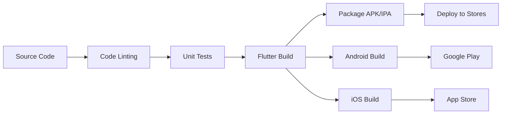

### 监控与分析
- **崩溃监控**: Firebase Crashlytics
- **性能监控**: Firebase Performance
- **用户分析**: Firebase Analytics
- **日志管理**: 结构化日志记录

## 开发指导原则

### 1. 代码组织
- 遵循Clean Architecture原则
- 单一职责：每个类只负责一个功能
- 依赖倒置：依赖抽象而不是具体实现
- 接口隔离：使用小而专注的接口

### 2. 性能优化
- 优先考虑用户体验
- 预加载与懒加载相结合
- 内存使用监控与自动清理
- 异步操作避免阻塞UI

### 3. 错误处理
- 全局错误捕获机制
- 优雅的错误恢复策略
- 用户友好的错误提示
- 详细的日志记录

### 4. 测试策略
- 单元测试：业务逻辑与Repository层
- Widget测试：UI组件行为
- 集成测试：端到端功能验证
- 性能测试：内存与渲染性能

## 总结

本架构蓝图为Easy-Comic Flutter漫画阅读器提供了完整的技术指导，涵盖了从系统设计到具体实现的各个层面。通过采用现代化的架构模式和最佳实践，确保了应用的可维护性、可扩展性和高性能。

**关键架构决策**：
1. **BLoC + Repository模式**：确保清晰的关注点分离和高度可测试性
2. **多级智能缓存**：平衡性能与资源使用，提供流畅的用户体验
3. **事件驱动架构**：提供可预测的状态管理和完整的用户行为追踪
4. **平台适配抽象**：支持未来的平台扩展和特性集成
5. **性能优先设计**：从架构层面确保应用的高性能表现

此架构蓝图可直接指导代码实现阶段的开发工作，为项目的成功交付提供坚实的技术基础。