# Flutter漫画阅读器核心组件架构图

**版本**: 1.0  
**作者**: 架构师模式  
**日期**: 2025-07-31  
**项目**: Easy-Comic Flutter漫画阅读器核心组件详细设计  

## 1. ReaderBloc状态管理核心架构

### 1.1 ReaderBloc组件结构图

### 1.2 状态转换流程图

### 1.3 事件处理数据流

## 2. Repository模式数据访问层架构

### 2.1 Repository层组件关系图

### 2.2 数据访问流程图

## 3. Service层组件关系图

### 3.1 核心服务架构

### 3.2 服务协作关系图

```mermaid
graph TB
    subgraph "Service Layer Collaboration"
        A[ReaderBloc<br/>状态管理中心] --> B[INavigationService<br/>导航服务]
        A --> C[IZoomService<br/>缩放服务]
        A --> D[IAutoPageService<br/>自动翻页服务]
        A --> E[IThemeService<br/>主题服务]
        A --> F[ICacheManager<br/>缓存管理服务]
        A --> G[IAnalyticsService<br/>分析服务]
        
        B --> H[页面导航逻辑<br/>历史记录管理]
        B --> I[书签跳转功能<br/>快速定位]
        
        C --> J[缩放级别控制<br/>手势缩放支持]
        C --> K[智能缩放算法<br/>适配不同屏幕]
        
        D --> L[定时翻页功能<br/>自动播放]
        D --> M[暂停/恢复控制<br/>用户交互感知]
        
        E --> N[主题切换逻辑<br/>亮度调节]
        E --> O[视觉效果管理<br/>用户体验优化]
        
        F --> P[多级缓存策略<br/>性能优化]
        F --> Q[预加载管理<br/>流畅体验]
        
        G --> R[用户行为统计<br/>使用模式分析]
        G --> S[性能指标收集<br/>优化指导]
    end
    
    subgraph "Service Communication"
        T[服务间通信] --> U[Event Bus<br/>事件总线]
        T --> V[Stream Communication<br/>流式通信]
        T --> W[Callback Pattern<br/>回调模式]
        
        U --> X[NavigationChanged Event<br/>页面变更事件]
        U --> Y[ZoomChanged Event<br/>缩放变更事件]
        U --> Z[ThemeChanged Event<br/>主题变更事件]
        
        V --> AA[Page Stream<br/>页面变更流]
        V --> BB[Zoom Stream<br/>缩放变更流]
        V --> CC[Settings Stream<br/>设置变更流]
    end
```

## 4. 缓存系统架构 (LRU + 异步加载)

### 4.1 缓存管理器详细架构

### 4.2 缓存策略流程图

### 4.3 异步加载时序图

## 5. 组件集成和通信机制

### 5.1 组件间通信架构

### 5.2 依赖注入和服务定位

---

## 总结

本核心组件架构图详细展示了Flutter漫画阅读器的核心组件内部结构和交互关系：

### 关键架构特点

1. **ReaderBloc状态管理**
   - 完整的事件驱动状态机
   - 异步数据流处理
   - 错误处理和恢复机制
   - 自动化进度保存和预加载

2. **Repository模式数据层**
   - 清晰的接口抽象
   - 多数据源整合
   - 缓存策略集成
   - 错误处理和重试机制

3. **Service层业务逻辑**
   - 服务间松耦合协作
   - 流式通信机制
   - 职责明确分离
   - 可扩展的架构设计

4. **智能缓存系统**
   - 多级LRU缓存策略
   - 优先级预加载队列
   - 内存压力自适应
   - 异步处理优化

5. **组件集成机制**
   - 依赖注入管理
   - 统一通信模式
   - 错误传播处理
   - 平台服务集成

这个架构设计确保了系统的高性能、可维护性和扩展性，为后续的代码实现提供了详细的技术指导。