# Flutter漫画阅读器系统架构设计

**版本**: 3.0  
**作者**: 架构师模式  
**日期**: 2025-07-31  
**项目**: Easy-Comic Flutter漫画阅读器整体系统架构  

## 1. 架构概述

### 1.1 设计理念
基于现有项目基础和技术规范，采用现代化的Flutter架构模式，实现高性能、可扩展、易维护的专业级漫画阅读器。核心设计原则：

- **关注点分离**: UI、业务逻辑、数据访问层清晰分离
- **单一职责**: 每个模块、类、函数职责明确
- **依赖倒转**: 高层模块不依赖低层模块，都依赖于抽象
- **开闭原则**: 对扩展开放，对修改封闭
- **性能优先**: 内存管理、异步处理、缓存策略全面优化

### 1.2 技术栈选择
- **状态管理**: BLoC模式 + Riverpod混合架构
- **数据持久化**: Drift (SQLite) + SharedPreferences
- **依赖注入**: GetIt Service Locator
- **文件处理**: archive插件 (CBZ/CBR/ZIP/RAR)
- **图像处理**: photo_view + InteractiveViewer
- **缓存策略**: 自定义LRU算法 + 异步预加载
- **平台集成**: hardware_buttons, wakelock, screen_brightness

## 2. 整体系统架构

### 2.1 三层架构设计

```mermaid
graph TB
    subgraph "UI层 (Presentation Layer)"
        direction TB
        A[ReaderScreen<br/>主阅读界面] --> B[ReaderCore<br/>核心显示组件]
        A --> C[TopMenuBar<br/>顶部菜单栏]
        A --> D[BottomProgressBar<br/>底部进度条]
        A --> E[SettingsPanel<br/>设置面板]
        A --> F[BookmarkPanel<br/>书签面板]
        
        B --> G[PageViewComponent<br/>翻页组件]
        B --> H[ContinuousScrollView<br/>连续滚动]
        B --> I[InteractiveImageViewer<br/>交互式图像查看器]
        
        J[ReaderGestureHandler<br/>手势处理器] --> B
        K[NavigationHandler<br/>导航处理器] --> B
        L[ZoomHandler<br/>缩放处理器] --> I
    end

    subgraph "业务逻辑层 (Business Logic Layer)"
        direction TB
        M[ReaderBloc<br/>阅读器状态管理] --> N[ReaderState<br/>不可变状态]
        M --> O[ReaderEvent<br/>事件定义]
        
        P[NavigationService<br/>导航服务] --> M
        Q[ZoomService<br/>缩放服务] --> M
        R[AutoPageService<br/>自动翻页服务] --> M
        S[ThemeService<br/>主题服务] --> M
        T[AnalyticsService<br/>分析服务] --> M
    end

    subgraph "数据层 (Data Layer)"
        direction TB
        U[ComicRepository<br/>漫画数据仓库] --> V[ArchiveService<br/>文档解析服务]
        U --> W[CacheManager<br/>缓存管理器]
        
        X[SettingsRepository<br/>设置数据仓库] --> Y[SharedPrefsService<br/>偏好设置服务]
        X --> Z[DriftDatabase<br/>SQLite数据库]
        
        AA[BookmarkRepository<br/>书签数据仓库] --> Z
        AA --> BB[ThumbnailService<br/>缩略图服务]
        
        CC[ProgressRepository<br/>进度数据仓库] --> Z
        CC --> DD[SyncService<br/>云同步服务]
    end

    subgraph "平台层 (Platform Layer)"
        direction TB
        EE[BrightnessService<br/>亮度控制]
        FF[WakelockService<br/>屏幕常亮]
        GG[HardwareButtonsService<br/>硬件按键]
        HH[SystemChromeService<br/>系统UI控制]
        II[VibrationService<br/>触觉反馈]
        JJ[FileSystemService<br/>文件系统访问]
    end

    %% 数据流连接
    A -.-> M
    M -.-> U
    M -.-> X
    M -.-> AA
    M -.-> CC
    
    U -.-> V
    U -.-> W
    X -.-> Y
    X -.-> Z
    AA -.-> Z
    AA -.-> BB
    CC -.-> Z
    CC -.-> DD
    
    M -.-> EE
    M -.-> FF
    M -.-> GG
    M -.-> HH
    M -.-> II
    U -.-> JJ
```

### 2.2 依赖注入架构

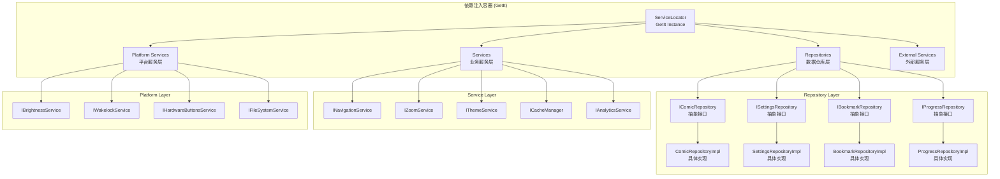

## 3. 核心组件架构设计

### 3.1 ReaderBloc状态管理核心架构

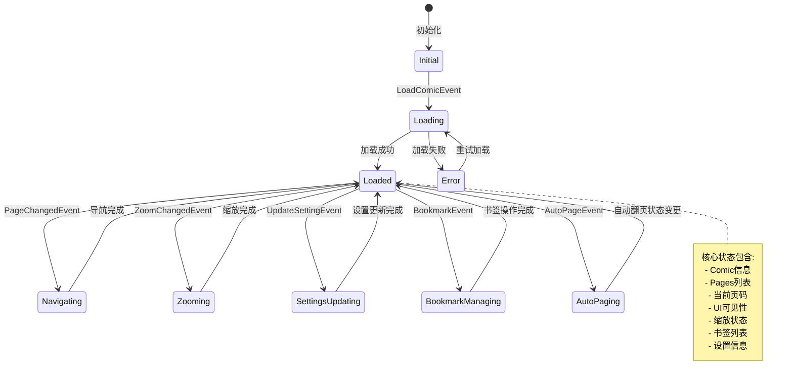

### 3.2 Repository模式数据访问层

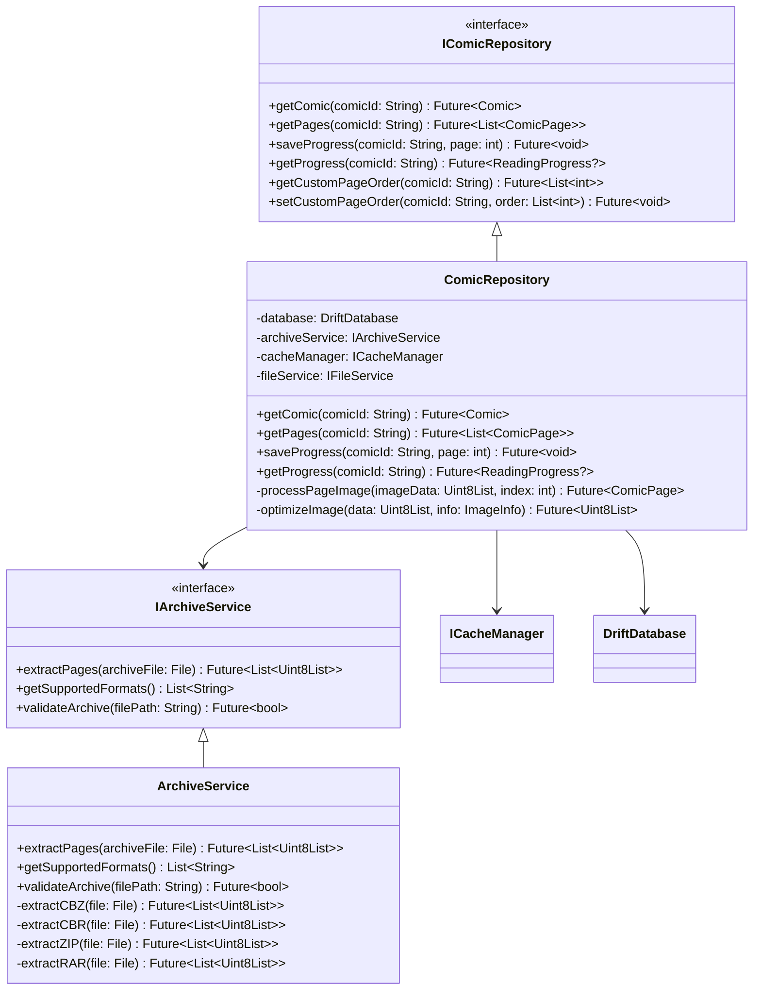

### 3.3 缓存系统架构 (LRU + 异步加载)

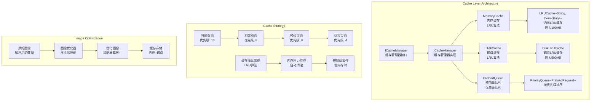

## 4. Flutter项目结构设计

### 4.1 目录结构规划

```
lib/
├── main.dart                           # 应用程序入口
├── app/                               # 应用程序配置
│   ├── app.dart                       # 主应用程序类
│   ├── app_router.dart                # 路由配置
│   ├── app_theme.dart                 # 主题配置
│   └── dependency_injection.dart      # 依赖注入配置
│
├── core/                              # 核心基础设施
│   ├── constants/                     # 常量定义
│   │   ├── app_constants.dart
│   │   ├── cache_constants.dart
│   │   └── ui_constants.dart
│   ├── errors/                        # 错误处理
│   │   ├── exceptions.dart
│   │   ├── failures.dart
│   │   └── error_handler.dart
│   ├── utils/                         # 工具类
│   │   ├── image_utils.dart
│   │   ├── file_utils.dart
│   │   ├── math_utils.dart
│   │   └── performance_utils.dart
│   ├── extensions/                    # 扩展方法
│   │   ├── string_extensions.dart
│   │   ├── list_extensions.dart
│   │   └── widget_extensions.dart
│   └── services/                      # 核心服务
│       ├── analytics_service.dart
│       ├── crash_reporting_service.dart
│       └── performance_monitoring_service.dart
│
├── data/                              # 数据层
│   ├── models/                        # 数据模型
│   │   ├── comic_model.dart
│   │   ├── page_model.dart
│   │   ├── bookmark_model.dart
│   │   ├── progress_model.dart
│   │   └── settings_model.dart
│   ├── repositories/                  # 数据仓库实现
│   │   ├── comic_repository_impl.dart
│   │   ├── settings_repository_impl.dart
│   │   ├── bookmark_repository_impl.dart
│   │   └── progress_repository_impl.dart
│   ├── datasources/                   # 数据源
│   │   ├── local/                     # 本地数据源
│   │   │   ├── drift_database.dart
│   │   │   ├── shared_prefs_service.dart
│   │   │   └── file_system_service.dart
│   │   └── remote/                    # 远程数据源（预留）
│   │       └── webdav_service.dart
│   └── cache/                         # 缓存实现
│       ├── cache_manager.dart
│       ├── lru_cache.dart
│       ├── disk_cache.dart
│       └── image_cache.dart
│
├── domain/                            # 领域层
│   ├── entities/                      # 领域实体
│   │   ├── comic.dart
│   │   ├── comic_page.dart
│   │   ├── bookmark.dart
│   │   ├── reading_progress.dart
│   │   └── reader_settings.dart
│   ├── repositories/                  # 仓库接口
│   │   ├── i_comic_repository.dart
│   │   ├── i_settings_repository.dart
│   │   ├── i_bookmark_repository.dart
│   │   └── i_progress_repository.dart
│   ├── usecases/                      # 用例
│   │   ├── comic/
│   │   │   ├── load_comic_usecase.dart
│   │   │   ├── get_pages_usecase.dart
│   │   │   └── save_progress_usecase.dart
│   │   ├── bookmark/
│   │   │   ├── add_bookmark_usecase.dart
│   │   │   ├── delete_bookmark_usecase.dart
│   │   │   └── get_bookmarks_usecase.dart
│   │   └── settings/
│   │       ├── get_settings_usecase.dart
│   │       └── update_settings_usecase.dart
│   └── services/                      # 领域服务接口
│       ├── i_navigation_service.dart
│       ├── i_zoom_service.dart
│       ├── i_cache_service.dart
│       └── i_analytics_service.dart
│
├── presentation/                      # 表现层
│   ├── reader/                        # 阅读器功能
│   │   ├── bloc/                      # BLoC状态管理
│   │   │   ├── reader_bloc.dart
│   │   │   ├── reader_event.dart
│   │   │   ├── reader_state.dart
│   │   │   └── reader_bloc.freezed.dart
│   │   ├── widgets/                   # UI组件
│   │   │   ├── reader_screen.dart
│   │   │   ├── reader_core.dart
│   │   │   ├── page_view_component.dart
│   │   │   ├── continuous_scroll_component.dart
│   │   │   ├── interactive_image_viewer.dart
│   │   │   ├── reader_gesture_handler.dart
│   │   │   ├── top_menu_bar.dart
│   │   │   ├── bottom_progress_bar.dart
│   │   │   ├── settings_panel.dart
│   │   │   ├── bookmark_panel.dart
│   │   │   └── loading_indicators.dart
│   │   ├── mixins/                    # 混入类
│   │   │   ├── navigation_mixin.dart
│   │   │   ├── zoom_mixin.dart
│   │   │   └── gesture_mixin.dart
│   │   └── utils/                     # 表现层工具
│   │       ├── reader_utils.dart
│   │       ├── gesture_utils.dart
│   │       └── animation_utils.dart
│   │
│   ├── home/                          # 主页功能
│   │   ├── bloc/
│   │   └── widgets/
│   │
│   ├── settings/                      # 设置功能
│   │   ├── bloc/
│   │   └── widgets/
│   │
│   └── shared/                        # 共享UI组件
│       ├── widgets/
│       │   ├── loading_widget.dart
│       │   ├── error_widget.dart
│       │   ├── empty_state_widget.dart
│       │   └── custom_dialogs.dart
│       ├── animations/
│       │   ├── page_transitions.dart
│       │   ├── fade_animations.dart
│       │   └── scale_animations.dart
│       └── themes/
│           ├── app_colors.dart
│           ├── app_text_styles.dart
│           └── app_dimensions.dart
│
├── infrastructure/                    # 基础设施层
│   ├── platform/                      # 平台服务实现
│   │   ├── brightness_service_impl.dart
│   │   ├── wakelock_service_impl.dart
│   │   ├── hardware_buttons_service_impl.dart
│   │   ├── vibration_service_impl.dart
│   │   └── file_system_service_impl.dart
│   ├── external/                      # 外部服务集成
│   │   ├── archive_service_impl.dart
│   │   ├── analytics_service_impl.dart
│   │   └── crash_reporting_service_impl.dart
│   └── navigation/                    # 导航实现
│       ├── app_router.dart
│       ├── route_generator.dart
│       └── navigation_service_impl.dart
│
└── generated/                         # 生成的代码
    ├── assets.gen.dart               # 资源文件生成
    ├── colors.gen.dart               # 颜色生成
    └── l10n/                         # 国际化生成
        └── app_localizations.dart
```

### 4.2 依赖管理策略

```dart
// app/dependency_injection.dart
class DependencyInjection {
  static Future<void> init() async {
    // Core Services
    GetIt.instance.registerLazySingleton<DriftDatabase>(
      () => DriftDatabase(),
    );
    
    GetIt.instance.registerLazySingleton<SharedPreferences>(
      () => SharedPreferencesService.instance,
    );
    
    // Platform Services
    GetIt.instance.registerLazySingleton<IBrightnessService>(
      () => BrightnessServiceImpl(),
    );
    
    GetIt.instance.registerLazySingleton<IWakelockService>(
      () => WakelockServiceImpl(),
    );
    
    GetIt.instance.registerLazySingleton<IHardwareButtonsService>(
      () => HardwareButtonsServiceImpl(),
    );
    
    // Cache Services
    GetIt.instance.registerLazySingleton<ICacheManager>(
      () => CacheManager(),
    );
    
    // External Services
    GetIt.instance.registerLazySingleton<IArchiveService>(
      () => ArchiveServiceImpl(),
    );
    
    GetIt.instance.registerLazySingleton<IFileSystemService>(
      () => FileSystemServiceImpl(),
    );
    
    // Repositories
    GetIt.instance.registerLazySingleton<IComicRepository>(
      () => ComicRepositoryImpl(
        database: GetIt.instance<DriftDatabase>(),
        archiveService: GetIt.instance<IArchiveService>(),
        cacheManager: GetIt.instance<ICacheManager>(),
        fileService: GetIt.instance<IFileSystemService>(),
      ),
    );
    
    GetIt.instance.registerLazySingleton<ISettingsRepository>(
      () => SettingsRepositoryImpl(
        sharedPrefs: GetIt.instance<SharedPreferences>(),
        database: GetIt.instance<DriftDatabase>(),
      ),
    );
    
    GetIt.instance.registerLazySingleton<IBookmarkRepository>(
      () => BookmarkRepositoryImpl(
        database: GetIt.instance<DriftDatabase>(),
        fileService: GetIt.instance<IFileSystemService>(),
      ),
    );
    
    // Use Cases
    GetIt.instance.registerLazySingleton<LoadComicUseCase>(
      () => LoadComicUseCase(
        repository: GetIt.instance<IComicRepository>(),
      ),
    );
    
    GetIt.instance.registerLazySingleton<GetPagesUseCase>(
      () => GetPagesUseCase(
        repository: GetIt.instance<IComicRepository>(),
      ),
    );
    
    // Services
    GetIt.instance.registerLazySingleton<INavigationService>(
      () => NavigationServiceImpl(),
    );
    
    GetIt.instance.registerLazySingleton<IZoomService>(
      () => ZoomServiceImpl(),
    );
    
    GetIt.instance.registerLazySingleton<IAnalyticsService>(
      () => AnalyticsServiceImpl(),
    );
  }
}
```

## 5. 性能优化架构

### 5.1 内存管理策略架构

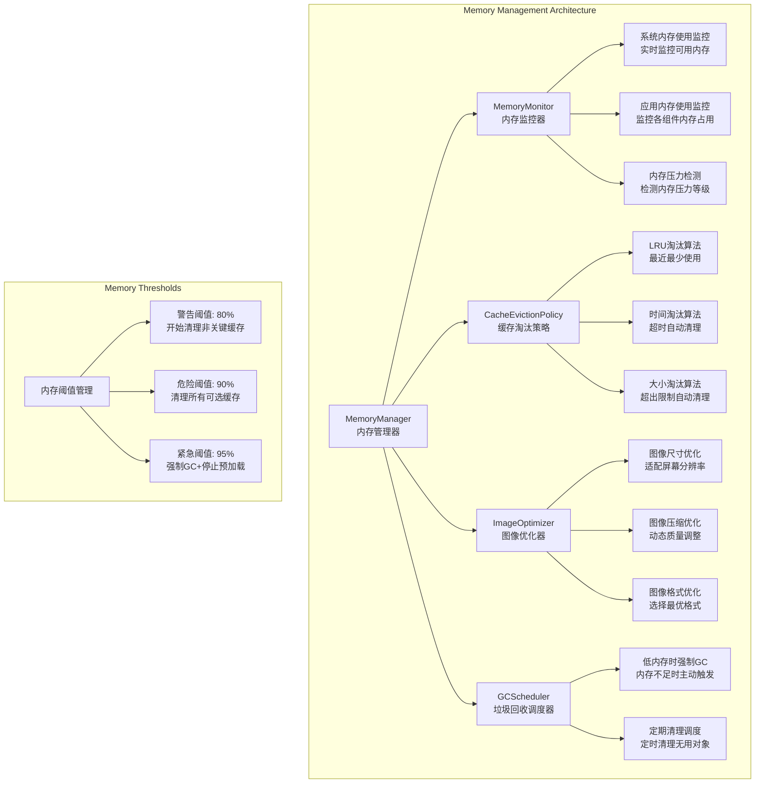

### 5.2 异步数据流设计

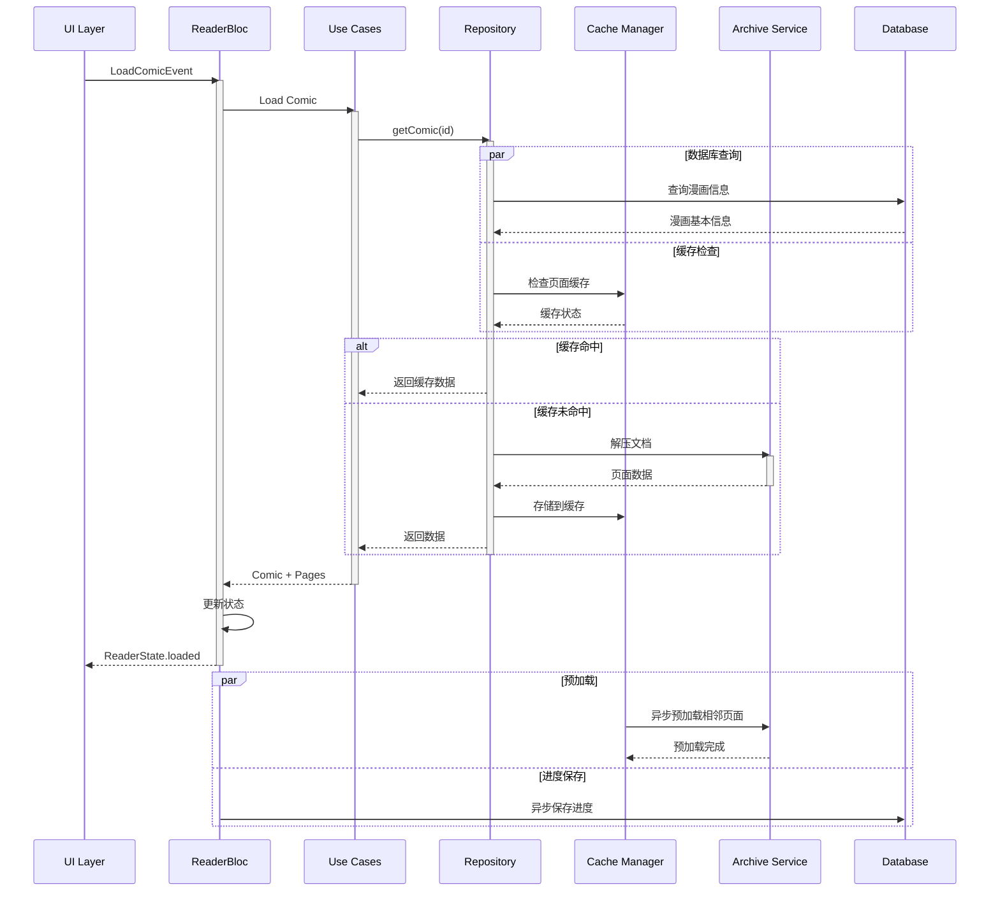

### 5.3 图像缓存和加载优化

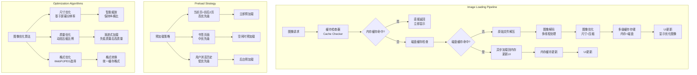

## 6. 平台适配架构

### 6.1 Android/iOS平台特定实现

```mermaid
graph TB
    subgraph "Platform Abstraction Layer"
        A[Platform Services Interface] --> B[Android Implementation]
        A --> C[iOS Implementation]
        A --> D[Desktop Implementation]
        
        E[IBrightnessService] --> F[AndroidBrightnessService]
        E --> G[IOSBrightnessService]
        
        H[IHardwareButtonsService] --> I[AndroidHardwareService]
        H --> J[IOSHardwareService]
        
        K[IFileSystemService] --> L[AndroidFileService]
        K --> M[IOSFileService]
        
        N[IVibrationService] --> O[AndroidVibrationService]
        N --> P[IOSVibrationService]
    end
    
    subgraph "Android Specific Features"
        F --> Q[系统亮度API<br/>Settings.System]
        I --> R[音量键监听<br/>KeyEvent处理]
        L --> S[SAF存储访问<br/>Storage Access Framework]
        O --> T[Vibrator API<br/>触觉反馈]
        
        U[Android生命周期管理] --> V[Activity状态监听]
        U --> W[内存压力监听]
        U --> X[电池状态监听]
    end
    
    subgraph "iOS Specific Features"
        G --> Y[UIScreen.brightness<br/>屏幕亮度控制]
        J --> Z[AVAudioSession<br/>音量键拦截]
        M --> AA[Files App集成<br/>文档选择器]
        P --> BB[UIImpactFeedbackGenerator<br/>触觉反馈]
        
        CC[iOS生命周期管理] --> DD[AppDelegate事件]
        CC --> EE[Memory Warning处理]
        CC --> FF[Background模式管理]
    end
```

### 6.2 响应式设计架构

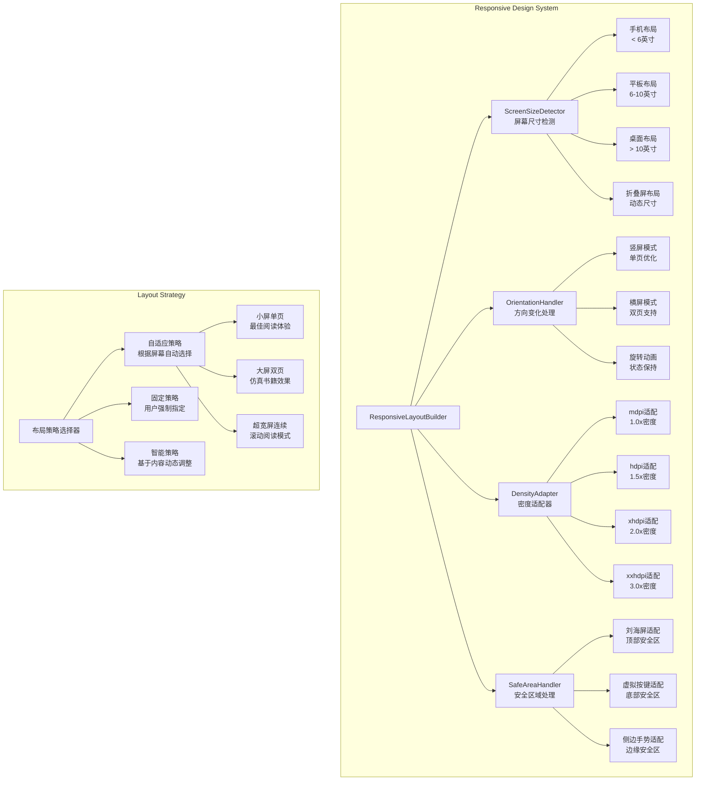

### 6.3 硬件集成架构

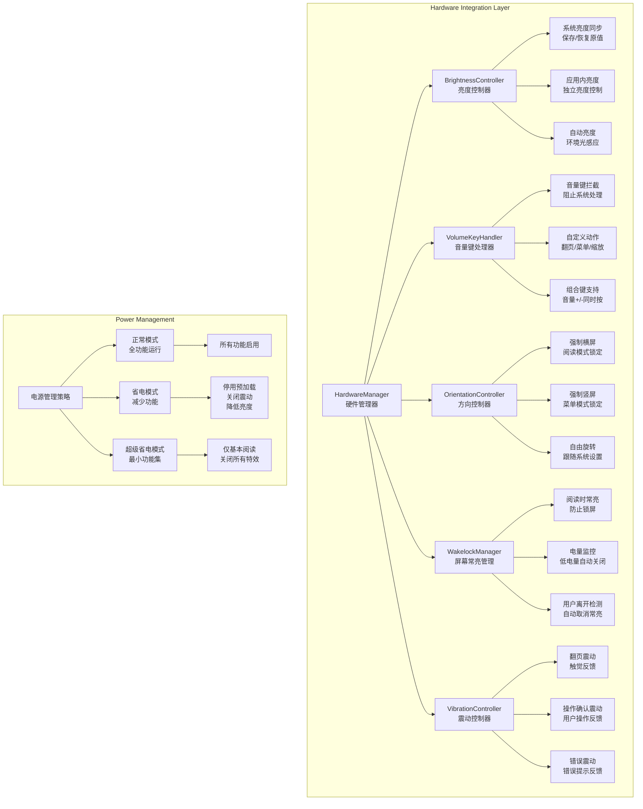

## 7. 数据流架构

### 7.1 单向数据流设计

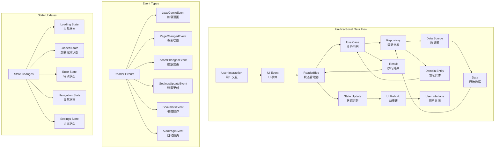

### 7.2 错误处理和恢复机制

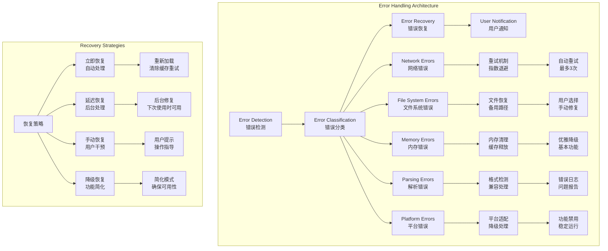

## 8. 安全性和隐私保护

### 8.1 数据安全架构

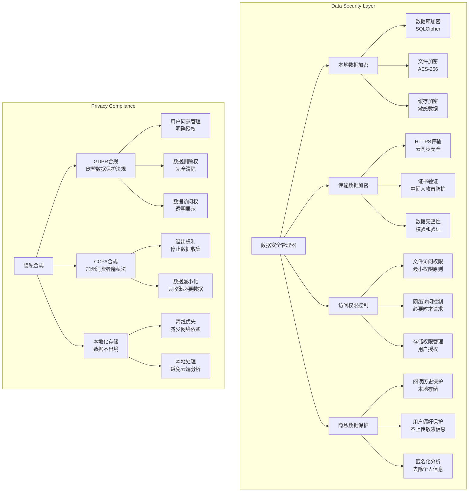

## 9. 监控和分析架构

### 9.1 性能监控系统

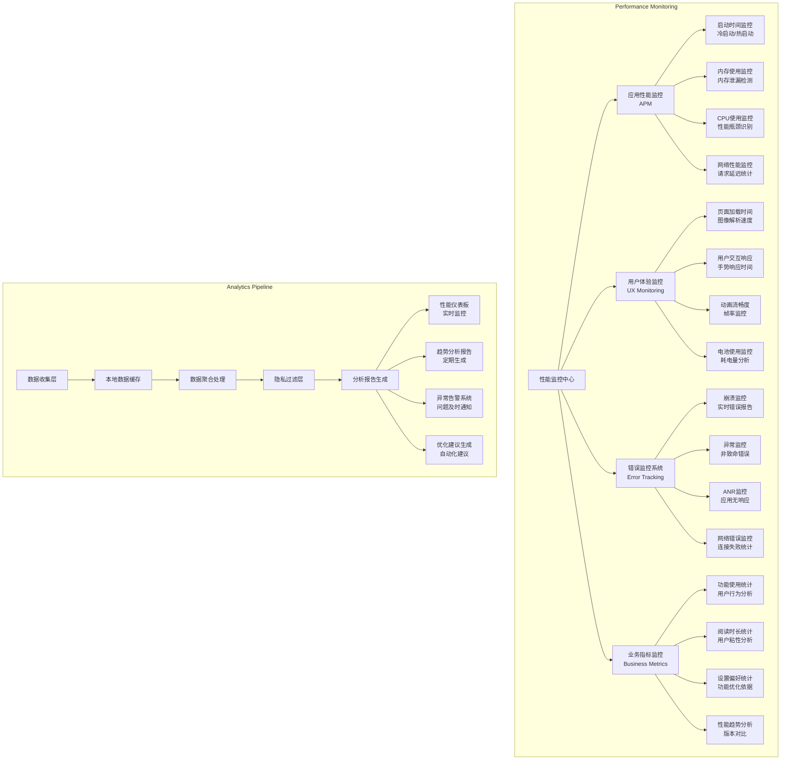

## 10. 部署和维护策略

### 10.1 持续集成/持续部署 (CI/CD)

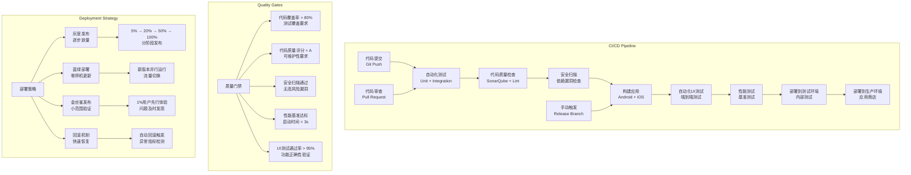

### 10.2 运维监控体系

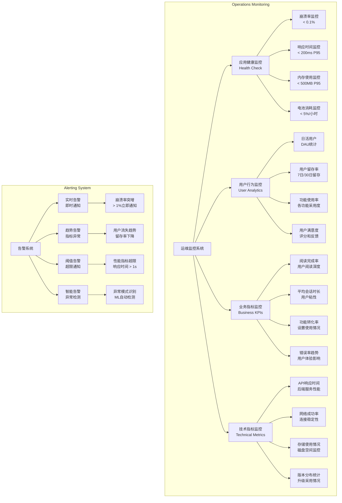

---

## 总结

本架构设计文档基于完整的技术规范和现有项目分析，提供了Flutter漫画阅读器的全面系统架构方案。关键特点包括：

### 架构优势
1. **清晰的分层设计**: UI层、业务逻辑层、数据层、平台层职责分明
2. **现代化架构模式**: BLoC状态管理 + Repository模式 + 依赖注入
3. **高性能优化**: LRU缓存、异步加载、内存管理、图像优化
4. **跨平台适配**: Android/iOS/Desktop平台特定实现
5. **可扩展性**: 模块化设计，易于添加新功能
6. **可维护性**: 代码结构清晰，测试友好

### 技术创新
1. **智能缓存系统**: 多级缓存 + 预加载策略 + 自动淘汰机制
2. **响应式架构**: 自适应布局 + 多屏幕尺寸支持
3. **性能监控**: 全链路性能监控 + 自动化告警
4. **安全隐私**: 数据加密 + 隐私保护 + 合规设计

### 实施建议
1. **分阶段实施**: 按照优先级逐步实现各个模块
2. **测试驱动**: 单元测试 + 集成测试 + 性能测试
3. **持续优化**: 基于用户反馈和性能监控持续改进
4. **文档维护**: 保持架构文档与代码同步更新

这个架构设计为后续的代码实现和系统集成提供了明确的技术蓝图，确保项目能够构建出专业级、高性能的漫画阅读器应用。