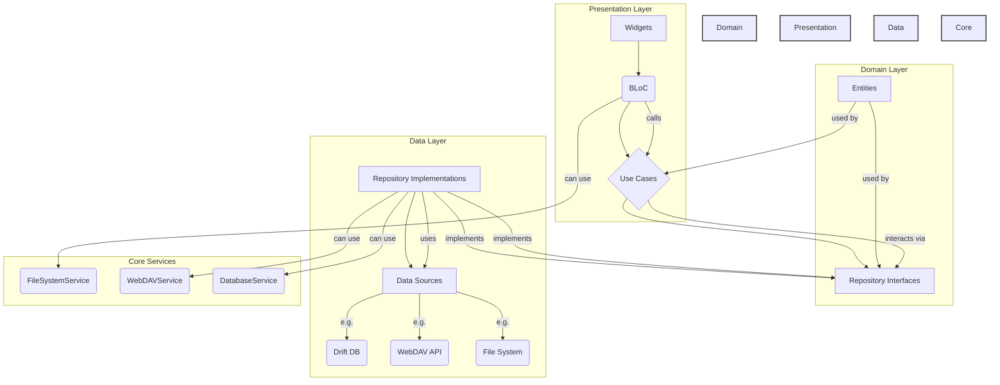

# Easy-Comic 重构架构方案

## 1. 概述

本文档基于 [`specs/refactor_spec.pseudo`](../specs/refactor_spec.pseudo) 规范，为 Easy-Comic 应用的重构提供一个清晰、可扩展的架构蓝图。该架构遵循**整洁架构 (Clean Architecture)** 原则，旨在实现关注点分离、高内聚、低耦合以及卓越的可测试性。

## 2. 核心架构原则

- **分层架构**: 严格划分为三个核心层次：表现层 (Presentation)、领域层 (Domain) 和数据层 (Data)。
- **依赖关系规则**: 所有依赖关系都指向内部。表现层依赖领域层，数据层依赖领域层。领域层不依赖任何其他层。
- **状态管理**: 采用 **BLoC (Business Logic Component)** 模式进行状态管理，确保UI与业务逻辑分离，并提供可预测的状态流。
- **依赖注入**: 使用 **`GetIt`** 作为服务定位器 (Service Locator) 来解耦组件，方便管理和测试。
- **模块化**: 功能将按特性模块进行组织，例如 `bookshelf`, `reader`, `settings` 等。

## 3. 架构图



## 4. 各层详解

### 4.1. 领域层 (Domain Layer)

领域层是应用的核心，包含所有业务逻辑和规则，完全独立于任何UI或数据源实现。

-   **Entities**: 定义核心业务对象（例如 `Manga`, `AppSettings`）。这些是纯粹的 Dart 对象，不包含任何框架依赖。
-   **Repositories (Interfaces)**: 定义数据操作的抽象接口（例如 `IMangaRepository`）。这些接口定义了领域层期望从数据层获得的数据契约，而不关心其具体实现。
-   **Use Cases (Interactors)**: 封装单一的业务操作（例如 `ImportComicUseCase`, `SyncDataUseCase`）。它们协调来自一个或多个仓库的数据流，以执行特定的业务任务。

### 4.2. 数据层 (Data Layer)

数据层负责实现领域层定义的仓库接口，并管理所有数据的来源。

-   **Models**: 数据传输对象 (DTOs) 或数据库表模型。这些模型可能包含特定于数据源的注解（例如 Drift 的 `Table` 注解），并负责将数据源的原始数据格式映射到领域层的实体。
-   **Data Sources**: 数据的直接来源，分为：
    -   **Local**: 本地数据源，如 `Drift` 数据库、`SharedPreferences` 或本地文件系统。
    -   **Remote**: 远程数据源，如 `WebDAV` 服务器的 API 接口。
-   **Repositories (Implementations)**: 实现领域层定义的仓库接口。它们是领域层和数据源之间的桥梁，负责从一个或多个数据源获取数据，并将其转换为领域层的实体。

### 4.3. 表现层 (Presentation Layer)

表现层负责所有与用户界面的交互。

-   **Widgets**: Flutter 的 UI 组件，负责渲染界面和响应用户输入。它们应该是“哑”组件，只负责展示状态和发送事件。
-   **BLoC (Business Logic Components)**: 接收来自 UI 的事件，调用领域层的用例来执行业务逻辑，并根据结果发出新的状态。UI 通过监听 BLoC 的状态流来更新自身。

## 5. 核心服务 (Core Services)

核心服务是跨多个层次共享的通用功能。它们通常被封装在 `core/services` 目录中，并通过依赖注入提供给需要它们的组件。

-   **`FileSystemService`**: 封装所有与本地文件系统交互的逻辑，如文件导入、提取、缩略图生成和清理。
-   **`WebDAVService`**: 处理与 WebDAV 服务器的所有通信，包括认证、数据同步和文件上传/下载。
-   **`DatabaseService`**: 管理数据库的初始化、迁移和访问。

## 6. 数据流示例：导入一本漫画

1.  **UI (BookshelfScreen)**: 用户点击“导入”按钮。`BookshelfBloc` 接收到一个 `ImportComicEvent`。
2.  **BLoC (BookshelfBloc)**: `BookshelfBloc` 调用 `ImportComicUseCase`。
3.  **UseCase (ImportComicUseCase)**:
    a.  调用 `FileSystemService` 来处理文件（验证、解压、移动、生成缩略图）。
    b.  `FileSystemService` 返回一个填充了元数据的 `Manga` 实体。
    c.  `ImportComicUseCase` 调用 `IMangaRepository` 的 `addManga` 方法来持久化这个新的 `Manga` 实体。
4.  **Repository (MangaRepositoryImpl)**:
    a.  将 `Manga` 实体转换为 `MangaModel` (Drift Table Companion)。
    b.  调用 `MangaDao` 将模型插入到数据库中。
5.  **BLoC (BookshelfBloc)**: 在用例成功完成后，`BookshelfBloc` 会从 `IMangaRepository` 的 `watchAllMangas` 流中接收到更新后的漫画列表，并发出一个新的 `BookshelfLoaded` 状态。
6.  **UI (BookshelfScreen)**: `BlocBuilder` 监听到新的状态，并重建 UI 以显示新导入的漫画。

## 7. 依赖注入 (GetIt)

所有仓库、用例、BLoC 和服务都将在应用启动时在 `lib/core/di/injection_container.dart` 中注册。

```dart
// 伪代码示例
final sl = GetIt.instance;

void init() {
  // Services
  sl.registerLazySingleton(() => FileSystemService());
  sl.registerLazySingleton(() => WebDAVService());
  
  // Repositories
  sl.registerLazySingleton<IMangaRepository>(() => MangaRepositoryImpl(sl()));

  // UseCases
  sl.registerLazySingleton(() => ImportComicUseCase(sl(), sl()));

  // BLoCs
  sl.registerFactory(() => BookshelfBloc(sl()));
  sl.registerFactory(() => ReaderBloc(sl(), sl()));
}