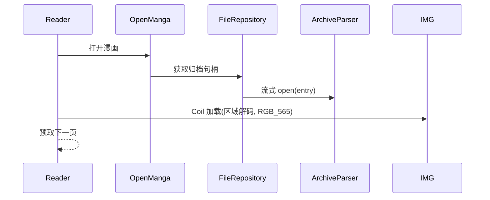
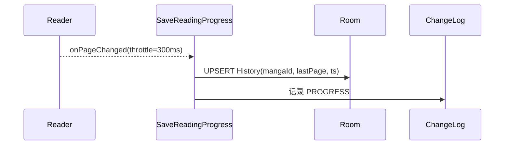
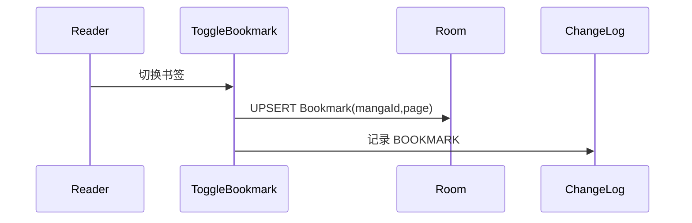

# Phase 2 Architecture

目录与命名规范

- 根包：com.easycomic（单 app module）
- 目录：app/src/main/java/com/easycomic/
  - presentation/
    - ui/{bookshelf,reader,settings,navigation,theme}
    - image/
  - domain/
    - model/
    - repository/（接口）
    - usecase/{manga}/（ScanAndImportManga、OpenManga、SaveReadingProgress、ToggleBookmark、QueryMangaList）
  - data/
    - repository/（MangaRepositoryImpl、BookmarkRepositoryImpl、HistoryRepositoryImpl、FileRepositoryImpl）
    - fileparser/（ArchiveParser、ZipCbzParser、RarCbrParser、ImageSorter、CoverExtractor）
    - database/{entity,dao}
    - remote/（预留）
  - di/（Hilt Modules & Bindings）
  - utils/（NaturalComparator、ZipList、FileUtils、ProbeBuilder、ImageUtils）

命名约定

- 实体：XxxEntity；DAO：XxxDao；仓库接口：XxxRepository；实现：XxxRepositoryImpl。
- 用例：动词+名词（e.g., ScanAndImportManga）。
- 解析器：XxxParser；策略/工厂：XxxStrategy/XxxFactory。

依赖关系示意

- 单向依赖：presentation → domain → data（data 依赖 Room/SAF/Coil/fileparser/utils）
- 规则：presentation 不依赖 data；domain 仅依赖接口与模型。

```mermaid
graph TD
    P[Presentation (Compose)] --> D[Domain (UseCases + Repos Interfaces)]
    D --> DA[Data (Repositories Impl)]
    DA --> FP[FileParser]
    DA --> DB[Room]
    DA --> UT[Utils]
    P --> IMG[Coil]
    FP -.-> RAR[Rar Engine]
    FP -.-> ZIP[Zip Engine]
```

DI 装配（Hilt）

- CoreModule
  - 提供 CoroutineDispatchers（Default/IO/Main），Clock，JSON，Logger（接口）。
- ParserModule
  - @Provides ZipCbzParser、RarCbrParser；Multi-binding Map<String, ArchiveParser>（键：格式/签名）。
  - 提供 ArchiveSelector：签名优先，扩展名兜底；返回所选 Parser。
- DataModule
  - @Binds MangaRepository -> MangaRepositoryImpl
  - @Binds BookmarkRepository -> BookmarkRepositoryImpl
  - @Binds HistoryRepository -> HistoryRepositoryImpl
  - @Binds FileRepository -> FileRepositoryImpl
- UseCaseModule
  - @Provides ScanAndImportManga、OpenManga、SaveReadingProgress、ToggleBookmark、QueryMangaList（注入 Repository）。
- DatabaseModule
  - @Provides Room Database、Dao；配置唯一约束与必要索引。

ArchiveParser 选择策略

- 读取头部若干字节判定签名（RAR5、ZIP）；异常时回退扩展名。
- 返回流式接口：listEntries()、open(entry): InputStream、size/mtime/路径编码辅助。
- 禁止全量解压；支持 ≥2GB；支持自然序排序与编码回退（UTF-8/CP437）。

数据流时序（导入/打开/阅读/进度/书签）

导入

```mermaid
sequenceDiagram
    participant UI as Presentation
    participant UC as ScanAndImportManga
    participant FR as FileRepository
    participant FP as ArchiveParser
    participant DB as Room
    UI->>UC: 选择目录/SAF 入口
    UC->>FR: 列举候选文件(ProbeBuilder)
    FR->>FP: 探测格式并读取元数据
    UC->>DB: UPSERT Manga/Entries/封面元
    UI<<--UC: 返回导入结果
```

打开与阅读



进度保存（防抖 300ms）



书签切换（唯一约束）



与第三阶段同步边界

- ChangeLog 导出游标：按自增 id/时间戳增量拉取（过滤 PROGRESS/BOOKMARK）。
- 冲突策略占位：同一条目重复时“最后写入覆盖”；Phase 3 细化可合并策略。
- 导出接口形态：suspend fun exportChangeLog(sinceCursor): Flow<ChangeLogEntity>。
- 安全与隐私：不包含原图，仅导出元信息与定位符。

附注

- 性能门槛：冷启动<2s；翻页P95<100ms；搜索<500ms，贯穿实现/测试基线。
- 错误处理：损坏归档与编码异常以占位图/替代字符回退，并记录告警。
- 配置：所有策略（预取窗口、解析器选择、缓存大小）外部可配置（不硬编码）。

更新时间：2025-08-08 21:40:30

参考目录

- [app/src/main/java/com/easycomic/](app/src/main/java/com/easycomic/)
- [memory-bank/productContext.md](memory-bank/productContext.md)
- [memory-bank/activeContext.md](memory-bank/activeContext.md)