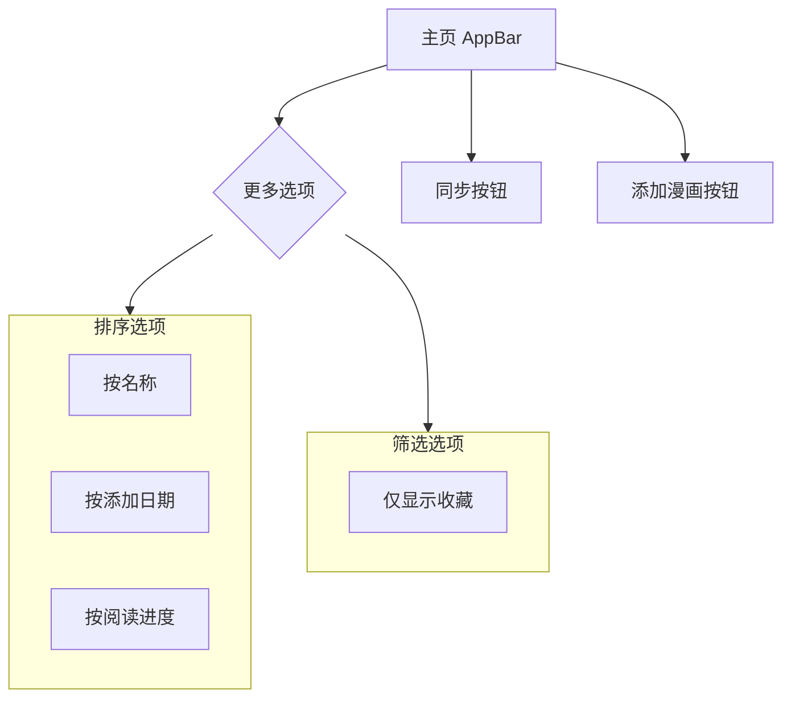
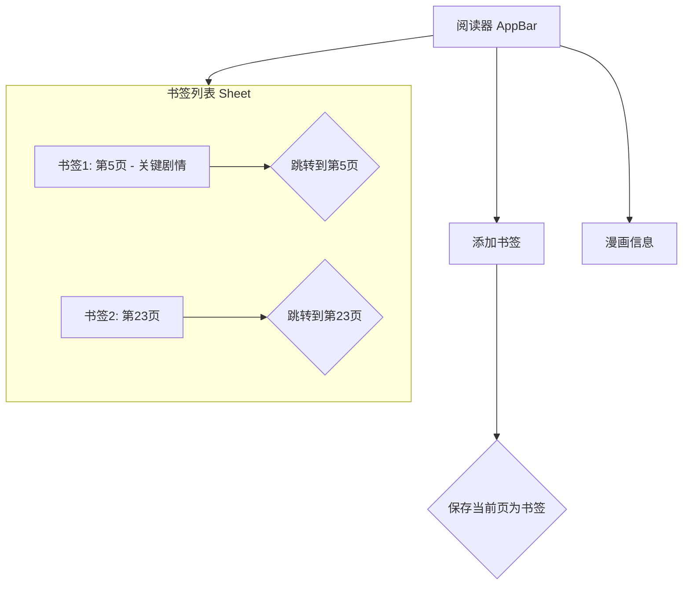

# Easy Comic 功能增强 - UI/UX 原型设计

本文档描述了为 Easy Comic 添加新功能（排序、收藏、书签）的用户界面和交互设计。

## 1. 主页 (`HomePage`)

主页将增强，以支持漫画的排序和筛选。

### 1.1. 交互流程

### 1.2. 界面描述

*   **AppBar**:
    *   在现有的“添加漫画”和“更多”按钮旁边，增加一个新的“排序”图标按钮 (`Icons.sort`)。
    *   点击“排序”按钮会弹出一个菜单，包含选项：“按名称”、“按添加日期”、“按阅读进度”。当前选中的排序方式会高亮显示。
    *   在“更多”菜单 (`PopupMenuButton`) 中，添加一个 `CheckedPopupMenuItem` 选项：“仅显示收藏”，用于切换筛选模式。
*   **漫画卡片 (`ComicCard`)**:
    *   卡片的右下角，删除按钮的旁边，增加一个“收藏”图标按钮 (`Icons.star_border` / `Icons.star`)。
    *   点击此按钮可以立即将漫画标记为收藏或取消收藏，并更新UI。
    *   底部的 `LinearProgressIndicator` 将直接绑定到数据库中的 `progress` 字段，实时显示阅读进度。

## 2. 阅读器页面 (`ReaderPage`)

阅读器页面将集成书签功能。

### 2.1. 交互流程

### 2.2. 界面描述

*   **AppBar**:
    *   在标题和“信息”按钮之间，增加两个新的 `IconButton`：
        1.  **添加书签** (图标: `bookmark_add`): 点击后，将当前页面保存为一个新的书签。会弹出一个 `AlertDialog`，让用户为书签添加一个可选的标签/描述。
        2.  **书签列表** (图标: `bookmarks`): 点击后，从屏幕底部滑出一个 `BottomSheet`，显示一个 `ListView`，包含当前漫画的所有书签。
*   **书签列表 (`BottomSheet`)**:
    *   `BottomSheet` 的标题为“书签”。
    *   列表中每一项都是一个 `ListTile`，`leading` 是页码，`title` 是书签的描述（如果存在），`trailing` 是一个删除按钮。
    *   点击 `ListTile` 本身，`BottomSheet` 会关闭，并且阅读器会跳转到该书签对应的页面。