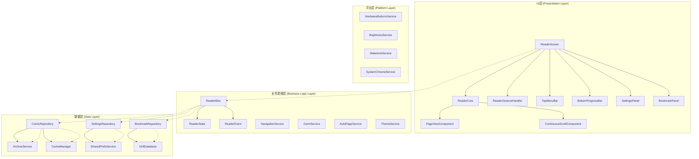
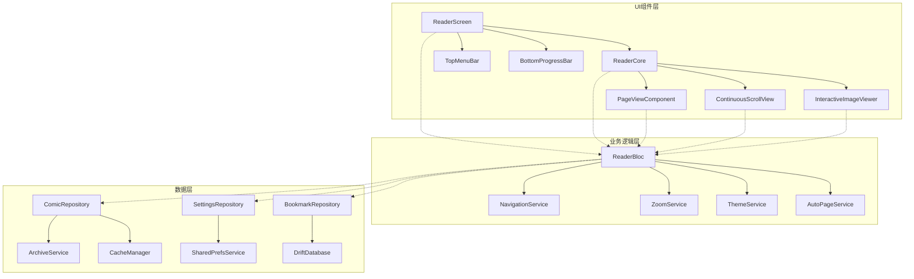

# Flutter本地漫画阅读器 - 核心阅读功能技术规范

**版本**: 2.0  
**作者**: 规范编写器模式  
**日期**: 2025-07-31  
**项目**: Easy-Comic Flutter漫画阅读器核心功能实现  

## 1. 项目概述

### 1.1 总体目标
基于现有的Flutter漫画阅读器架构，实现一个功能完善、性能优异的专业级漫画阅读核心系统。采用BLoC架构模式，实现UI、业务逻辑和数据层的清晰分离，提供流畅的阅读体验和高度的定制化功能。

### 1.2 核心特性
- **专业阅读体验**: 流畅的翻页动画、智能缩放、多种阅读模式
- **高级交互控制**: 手势识别、键盘快捷键、自动翻页
- **性能优化**: LRU缓存、异步加载、内存管理
- **个性化定制**: 主题切换、亮度调节、阅读模式配置
- **数据持久化**: 书签管理、阅读进度、用户偏好设置

### 1.3 技术栈
- **框架**: Flutter 3.x
- **状态管理**: BLoC + Riverpod混合架构
- **数据持久化**: Drift (SQLite) + SharedPreferences
- **文件处理**: archive插件 (CBZ/CBR/ZIP/RAR)
- **图像处理**: photo_view + cached_network_image
- **平台功能**: hardware_buttons, wakelock, system_chrome

## 2. 架构设计

### 2.1 整体架构图



### 2.2 模块划分

#### 2.2.1 核心显示模块 (Core Display Module)
- **ReaderCore**: 主要阅读界面容器
- **PageViewComponent**: 水平翻页组件
- **ContinuousScrollComponent**: 垂直滚动组件
- **InteractiveImageViewer**: 支持缩放平移的图像查看器

#### 2.2.2 交互控制模块 (Interaction Control Module)
- **ReaderGestureHandler**: 手势识别和处理
- **NavigationHandler**: 翻页导航逻辑
- **ZoomHandler**: 缩放控制逻辑
- **KeyboardHandler**: 键盘事件处理

#### 2.2.3 用户界面模块 (User Interface Module)
- **TopMenuBar**: 顶部菜单栏
- **BottomProgressBar**: 底部进度条
- **SettingsPanel**: 设置面板
- **BookmarkPanel**: 书签管理面板

#### 2.2.4 数据管理模块 (Data Management Module)
- **ComicRepository**: 漫画数据仓库
- **SettingsRepository**: 设置数据仓库
- **BookmarkRepository**: 书签数据仓库
- **CacheManager**: 缓存管理器

#### 2.2.5 平台适配模块 (Platform Adaptation Module)
- **BrightnessService**: 亮度控制服务
- **WakelockService**: 屏幕常亮服务
- **SystemChromeService**: 系统UI控制服务
- **HardwareButtonsService**: 硬件按键服务

## 3. 详细功能规范

### 3.1 核心显示与导航

#### 3.1.1 主图像查看器
```yaml
组件: PageViewComponent
功能:
  - 基于PageView.builder实现水平翻页
  - 支持预加载前后页面(preloadCount: 2)
  - 集成PhotoView支持缩放和平移
  - 自定义页面过渡动画(slide, fade, none)
  - 支持RTL阅读方向

技术实现:
  - 使用PageController管理页面状态
  - 集成TransformationController处理缩放
  - 自定义PageTransition动画控制器
```

#### 3.1.2 流畅页面过渡
```yaml
组件: PageTransitionManager  
功能:
  - 支持多种过渡效果: slide, fade, scale, none
  - 自定义动画曲线和持续时间配置
  - 基于设备性能自动调整动画质量
  - 支持方向感知的过渡效果

配置参数:
  - duration: 300ms (可配置)
  - curve: Curves.easeInOut
  - reverseDuration: 200ms
```

#### 3.1.3 导航功能
```yaml
功能规范:
  上一页/下一页:
    - 支持手势滑动、点击区域、键盘快捷键
    - 边界处理: 到达首/末页时的视觉反馈
    - 循环播放模式(可选)
  
  跳转功能:
    - 页面输入框直接跳转
    - 进度条拖拽跳转
    - 书签快速跳转
    - 章节导航(如果支持)
```

#### 3.1.4 手势识别
```yaml
组件: ReaderGestureHandler
手势类型:
  单击:
    - 点击区域划分: 左25%, 中50%, 右25%
    - 左侧: 上一页 | 中间: 切换UI | 右侧: 下一页
    - 支持自定义点击区域大小
  
  双击:
    - 智能缩放: 100% -> 200% -> 适应屏幕
    - 双击位置为缩放中心点
    - 平滑缩放动画
  
  捏合手势:
    - 缩放范围: 0.5x - 5.0x
    - 实时缩放反馈
    - 缩放中心跟随手指中心点
  
  长按:
    - 显示上下文菜单
    - 添加书签快捷操作
```

#### 3.1.5 进度指示器
```yaml
组件: PageProgressIndicator
显示格式: "E1:P1" (Episode 1: Page 1)
功能:
  - 实时更新当前页码
  - 支持总页数显示
  - 章节信息显示(如果可用)
  - 阅读进度百分比
  - 预计剩余阅读时间
```

#### 3.1.6 自动翻页
```yaml
组件: AutoPageService
功能:
  - 可配置时间间隔 (默认5秒)
  - 暂停/恢复控制
  - 到达末页自动停止
  - 手势交互时自动暂停
  - 后台时自动暂停

配置选项:
  - 时间间隔: 3-30秒可调
  - 启用条件: 手动开启
  - 暂停条件: 用户交互、应用后台、电池低电量
```

### 3.2 阅读模式与屏幕配置

#### 3.2.1 屏幕方向控制
```yaml
组件: OrientationManager
功能:
  - 自动旋转 | 锁定竖屏 | 锁定横屏
  - 基于内容自动选择最佳方向
  - 旋转时保持当前页面和缩放状态
  - 平滑的布局过渡动画

技术实现:
  - SystemChrome.setPreferredOrientations()
  - OrientationBuilder响应方向变化
  - 状态保持和恢复机制
```

#### 3.2.2 阅读模式
```yaml
模式类型:
  单页模式:
    - 一次显示一页
    - 最佳阅读体验
    - 支持所有交互功能
  
  双页模式:
    - 横屏时显示两页
    - 仿真书籍阅读体验
    - 智能页面匹配算法
  
  连续滚动:
    - 垂直连续滚动所有页面
    - 适合长条形漫画
    - 支持缩放和横向平移
  
  自适应模式:
    - 根据屏幕方向自动切换
    - 竖屏=单页，横屏=双页
```

#### 3.2.3 屏幕常亮
```yaml
组件: WakelockService
功能:
  - 阅读时保持屏幕常亮
  - 离开阅读界面自动取消
  - 电池电量低时自动禁用
  - 用户可手动开关

集成:
  - wakelock插件
  - 生命周期感知
  - 电池状态监听
```

### 3.3 缩放与交互控制

#### 3.3.1 图像缩放
```yaml
组件: InteractiveImageViewer
功能:
  - 缩放范围: 0.5x - 5.0x
  - 智能缩放等级: 适应宽度、适应高度、原始大小
  - 平滑缩放动画 (duration: 300ms)
  - 缩放状态持久化

手势支持:
  - 双指捏合缩放
  - 双击智能缩放
  - 滚轮缩放(桌面端)

技术实现:
  - InteractiveViewer + TransformationController
  - 自定义缩放算法
  - 边界检测和回弹效果
```

#### 3.3.2 智能缩放算法
```yaml
智能缩放等级:
  适应屏幕 (Fit Screen):
    - 完整显示整页内容
    - 保持页面宽高比
    - 自动居中显示
  
  适应宽度 (Fit Width):
    - 页面宽度匹配屏幕宽度
    - 可能需要垂直滚动
    - 适合大部分阅读场景
  
  适应高度 (Fit Height):
    - 页面高度匹配屏幕高度
    - 可能需要水平滚动
    - 适合长条形页面
  
  原始大小 (Original Size):
    - 显示页面原始尺寸
    - 1:1像素映射
    - 最清晰的显示效果
```

#### 3.3.3 点击区域配置
```yaml
组件: TapZoneConfiguration
配置参数:
  区域大小: 默认各占25%屏幕宽度
  自定义选项:
    - 左侧区域: 0-50%
    - 右侧区域: 0-50%
    - 中间区域: 自动计算
  
功能映射:
  左侧区域: 上一页/自定义动作
  右侧区域: 下一页/自定义动作  
  中间区域: 切换UI/自定义动作
  
用户配置:
  - 可视化区域编辑器
  - 实时预览效果
  - 一键恢复默认
```

#### 3.3.4 硬件按键支持
```yaml
组件: HardwareButtonsService
支持按键:
  音量键:
    - 音量+ : 下一页
    - 音量- : 上一页
    - 可自定义映射
  
  返回键:
    - 短按: 返回上级
    - 长按: 退出应用
  
  其他按键:
    - 电源键: 锁屏(系统默认)
    - 菜单键: 显示设置(如果可用)

技术实现:
  - hardware_buttons插件
  - 系统级按键拦截
  - 按键事件映射表
```

### 3.4 视觉效果与主题管理

#### 3.4.1 主题系统
```yaml
组件: ThemeManager
预设主题:
  日间模式:
    - 背景色: Colors.white
    - 前景色: Colors.black
    - 强调色: Colors.blue
  
  夜间模式:
    - 背景色: Colors.black
    - 前景色: Colors.white
    - 强调色: Colors.blueAccent
  
  护眼模式:
    - 背景色: Color(0xFFF5F5DC) // 米色
    - 前景色: Colors.black87
    - 强调色: Colors.brown
  
  自定义主题:
    - 用户可自定义所有颜色
    - 支持渐变背景
    - 主题导入/导出功能
```

#### 3.4.2 动态亮度调节
```yaml
组件: BrightnessService
功能:
  - 独立于系统亮度的应用内亮度调节
  - 实时预览调节效果
  - 亮度预设 (暗、适中、亮、超亮)
  - 自动亮度(基于环境光感应器)

技术实现:
  - 覆盖层透明度调节
  - 系统亮度API调用
  - 环境光传感器集成
  - 平滑过渡动画
```

#### 3.4.3 全屏阅读模式
```yaml
组件: ImmersiveModeManager
功能:
  - 隐藏状态栏和导航栏
  - 沉浸式阅读体验
  - 手势或按键快速切换
  - 应用切换时自动恢复

实现方式:
  - SystemChrome.setSystemUIOverlay
  - 全屏状态持久化
  - 平台适配(Android/iOS)
```

#### 3.4.4 页面信息显示
```yaml
组件: PageInfoOverlay
显示内容:
  - 当前页码/总页数
  - 当前章节信息
  - 阅读进度百分比
  - 预计剩余时间
  - 文件名称
  - 文件大小

显示模式:
  - 始终显示
  - 自动隐藏 (3秒后)
  - 手动切换
  - 完全隐藏

样式配置:
  - 位置: 顶部/底部/浮动
  - 透明度: 0.5-1.0
  - 字体大小: 小/中/大
```

#### 3.4.5 动画效果
```yaml
组件: AnimationManager
动画类型:
  页面过渡:
    - slide: 滑动效果
    - fade: 淡入淡出
    - scale: 缩放效果
    - none: 无动画
  
  UI动画:
    - 菜单栏显隐动画
    - 进度条更新动画
    - 缩放平移动画
    - 主题切换动画

性能优化:
  - 动画帧率限制
  - 低端设备自动降级
  - 用户可关闭动画
  - GPU加速优化
```

### 3.5 文件处理与性能优化

#### 3.5.1 文件格式支持
```yaml
组件: ArchiveManager
支持格式:
  - CBZ (Comic Book ZIP)
  - CBR (Comic Book RAR) 
  - ZIP (通用ZIP压缩)
  - RAR (通用RAR压缩)
  - 7Z (7-Zip格式)
  - 目录形式(图片文件夹)

技术实现:
  - archive插件解压
  - 多线程处理
  - 增量解压(按需)
  - 错误恢复机制
```

#### 3.5.2 图像缓存系统
```yaml
组件: ImageCacheManager
缓存策略:
  LRU算法:
    - 最大缓存大小: 100MB (可配置)
    - 最大缓存文件数: 200个
    - 自动清理过期缓存
  
  预加载策略:
    - 当前页+前后各2页
    - 后台预加载优化
    - 网络状态感知
  
  缓存层级:
    - 内存缓存 (快速访问)
    - 磁盘缓存 (持久化)
    - 原始文件 (解压缓存)

配置选项:
  - 缓存大小限制
  - 预加载页数
  - 缓存清理策略
  - 低内存设备优化
```

#### 3.5.3 异步加载机制
```yaml
组件: AsyncImageLoader
功能:
  - 多线程图像解压和解码
  - 优先级队列 (当前页>相邻页>远程页)
  - 加载进度指示器
  - 取消未完成加载

性能优化:
  - Isolate并行处理
  - 内存压力监控
  - 加载超时处理
  - 图像格式优化
```

#### 3.5.4 内存管理
```yaml
组件: MemoryManager
监控指标:
  - 内存使用量实时监控
  - 图像缓存占用分析
  - 内存泄露检测
  - GC触发频率分析

优化策略:
  - 低内存时自动清理缓存
  - 图像质量动态调整
  - 预加载数量动态调整
  - Widget树优化

内存阈值:
  - 警告阈值: 80%可用内存
  - 清理阈值: 90%可用内存
  - 紧急阈值: 95%可用内存
```

### 3.6 用户界面组件

#### 3.6.1 底部控制栏
```yaml
组件: BottomControlBar
功能模块:
  播放控制:
    - 播放/暂停自动翻页
    - 播放速度调节
    - 循环播放开关
  
  导航控制:
    - 上一页/下一页按钮
    - 页面跳转输入框
    - 进度滑动条
  
  快捷操作:
    - 书签添加/删除
    - 设置面板快速开关
    - 分享功能
  
显示模式:
  - 自动隐藏 (5秒无操作)
  - 点击切换显示/隐藏
  - 始终显示模式
```

#### 3.6.2 设置持久化
```yaml
组件: SettingsRepository
存储方式: SharedPreferences + Drift数据库
设置分类:
  
  阅读偏好:
    - 阅读模式 (单页/双页/连续)
    - 阅读方向 (LTR/RTL/垂直)
    - 页面过渡动画
    - 自动翻页间隔
  
  显示设置:
    - 主题模式 (日间/夜间/护眼)
    - 亮度设置
    - 全屏模式
    - UI显示偏好
  
  交互设置:
    - 手势配置
    - 点击区域设置
    - 硬件按键映射
    - 音量键翻页
  
  性能设置:
    - 缓存大小限制
    - 预加载页数
    - 动画开关
    - 内存优化级别
```

#### 3.6.3 进度导航滑块
```yaml
组件: ProgressSlider
功能:
  - 拖拽式页面导航
  - 实时页面预览 (缩略图)
  - 精确页码显示
  - 书签位置标记
  - 章节分界线显示

交互特性:
  - 平滑拖拽反馈
  - 磁性吸附到书签
  - 快速双击跳转
  - 长按显示详细信息

自定义选项:
  - 滑块高度和样式
  - 缩略图显示开关
  - 书签标记样式
  - 位置: 底部/顶部/浮动
```

#### 3.6.4 书签收藏功能
```yaml
组件: BookmarkManager
功能特性:
  添加书签:
    - 当前页快速添加
    - 自定义标签描述
    - 自动截图预览
    - 添加时间记录
  
  书签管理:
    - 书签列表查看
    - 书签编辑/删除
    - 书签导出/导入
    - 书签搜索筛选
  
  快速访问:
    - 书签缩略图预览
    - 一键跳转功能
    - 书签排序 (时间/页码/标签)
    - 书签分组管理

数据存储:
  - Drift数据库存储
  - 书签数据同步
  - 导出格式: JSON/CSV
```

#### 3.6.5 阅读进度存储
```yaml
组件: ProgressManager
跟踪数据:
  - 当前阅读页码
  - 总阅读时长
  - 最后阅读时间
  - 阅读会话记录
  - 阅读速度统计

存储策略:
  - 实时保存 (页面切换时)
  - 批量更新 (减少I/O)
  - 应用退出时强制保存
  - 异常退出恢复机制

统计功能:
  - 每日阅读时长
  - 阅读习惯分析
  - 进度图表展示
  - 阅读目标设定
```

### 3.7 状态管理与架构

#### 3.7.1 BLoC状态管理
```yaml
架构模式: BLoC + Repository
核心组件:
  ReaderBloc:
    - States: ReaderState (不可变状态类)
    - Events: ReaderEvent (用户交互事件)
    - 业务逻辑处理中心
    - 状态变更通知
  
  ReaderState:
    - 当前页码和总页数
    - 加载状态和错误信息
    - 缩放和UI显示状态
    - 书签和设置信息
  
  ReaderEvent:
    - LoadComicEvent (加载漫画)
    - PageChangedEvent (页面切换)
    - ZoomChangedEvent (缩放变更)
    - SettingsUpdateEvent (设置更新)
    - BookmarkEvent (书签操作)

数据流:
  UI -> Event -> BLoC -> Repository -> Data Source
  Data Source -> Repository -> BLoC -> State -> UI
```

#### 3.7.2 Repository模式
```yaml
数据抽象层:
  ComicRepository:
    - 漫画文件管理
    - 页面数据提供
    - 阅读历史记录
    - 缓存策略实现
  
  SettingsRepository:
    - 用户偏好设置
    - 应用配置管理
    - 主题和显示设置
    - 性能参数配置
  
  BookmarkRepository:
    - 书签数据管理
    - CRUD操作封装
    - 数据同步机制
    - 导入导出功能

优势:
  - 数据源抽象
  - 业务逻辑分离
  - 测试友好
  - 可扩展性强
```

#### 3.7.3 服务层设计
```yaml
核心服务:
  ImageService:
    - 图像加载和解码
    - 缓存管理
    - 格式转换
    - 性能优化
  
  NavigationService:
    - 页面导航逻辑
    - 历史记录管理
    - 路由参数传递
    - 深度链接处理
  
  ThemeService:
    - 主题切换逻辑
    - 颜色方案管理
    - 动态主题生成
    - 主题数据持久化
  
  PlatformService:
    - 平台特性封装
    - 硬件功能调用
    - 系统API包装
    - 兼容性处理
```

### 3.8 平台适配与优化

#### 3.8.1 Android平台优化
```yaml
优化策略:
  性能优化:
    - 使用Skia渲染引擎
    - GPU加速图像处理
    - 内存映射文件读取
    - 垃圾回收优化
  
  系统集成:
    - 状态栏和导航栏控制
    - 全屏沉浸式体验
    - 系统亮度调节
    - 硬件按键处理
  
  电池优化:
    - 后台任务限制
    - 屏幕常亮智能管理
    - CPU使用率控制
    - 网络请求优化
  
  兼容性:
    - Android 6.0+ 支持
    - 不同屏幕密度适配
    - 折叠屏设备支持
    - 平板电脑优化
```

#### 3.8.2 iOS平台优化
```yaml
优化策略:
  性能优化:
    - Metal渲染管道
    - 核心动画优化
    - 内存压力处理
    - 后台任务管理
  
  系统集成:
    - 安全区域适配
    - 动态岛适配
    - 系统手势兼容
    - 控制中心集成
  
  用户体验:
    - 触觉反馈集成
    - 系统分享扩展
    - Siri快捷指令
    - Spotlight搜索
  
  兼容性:
    - iOS 12.0+ 支持
    - iPhone/iPad通用
    - 不同屏幕尺寸适配
    - 可访问性支持
```

#### 3.8.3 响应式布局
```yaml
设计原则:
  屏幕尺寸适配:
    - 小屏设备 (<6英寸): 优化触摸区域
    - 中屏设备 (6-8英寸): 平衡显示和操作
    - 大屏设备 (>8英寸): 双栏布局支持
    - 折叠屏: 动态布局切换
  
  方向适配:
    - 竖屏: 单页模式优先
    - 横屏: 双页模式或全屏
    - 旋转动画: 平滑过渡
    - 状态保持: 页码和缩放
  
  密度适配:
    - mdpi/hdpi/xhdpi/xxhdpi支持
    - 矢量图标使用
    - 文字大小自适应
    - 触摸区域密度调整
```

#### 3.8.4 错误处理机制
```yaml
错误分类:
  文件错误:
    - 文件不存在/损坏
    - 格式不支持
    - 权限不足
    - 磁盘空间不足
  
  网络错误:
    - 连接超时
    - 下载失败
    - 同步错误
    - 服务器异常
  
  系统错误:
    - 内存不足
    - 存储空间不足
    - 系统版本不兼容
    - 权限被拒绝

处理策略:
  - 优雅降级处理
  - 用户友好错误提示
  - 自动重试机制
  - 错误日志记录
  - 崩溃报告上传
```

## 4. 数据模型定义

### 4.1 核心数据模型

```dart
// 阅读器状态模型
class ReaderState {
  final Comic? comic;
  final List<ComicPage> pages;
  final int currentPage;
  final bool isLoading;
  final String? error;
  final ReaderSettings settings;
  final bool isUiVisible;
  final double zoomScale;
  final List<Bookmark> bookmarks;
  final Map<int, String> thumbnailCache;
}

// 漫画信息模型
class Comic {
  final String id;
  final String title;
  final String filePath;
  final int totalPages;
  final double progress;
  final DateTime lastReadAt;
  final String? thumbnailPath;
}

// 漫画页面模型
class ComicPage {
  final int index;
  final Uint8List imageData;
  final String? imagePath;
  final Size imageSize;
  final String format;
}

// 阅读器设置模型
class ReaderSettings {
  final ReadingMode readingMode;
  final NavigationDirection navigationDirection;
  final BackgroundTheme backgroundTheme;
  final double brightness;
  final bool enableAutoPage;
  final int autoPageInterval;
  final bool enableWakelock;
  final bool showProgress;
  final TapZoneConfig tapZoneConfig;
}

// 书签模型
class Bookmark {
  final String id;
  final String comicId;
  final int pageIndex;
  final String? label;
  final DateTime createdAt;
  final String? thumbnailPath;
}
```

### 4.2 事件模型

```dart
// 阅读器事件基类
abstract class ReaderEvent {}

// 具体事件类型
class LoadComicEvent extends ReaderEvent {
  final String comicId;
  final int? initialPage;
}

class PageChangedEvent extends ReaderEvent {
  final int newPage;
  final bool saveProgress;
}

class ZoomChangedEvent extends ReaderEvent {
  final double newScale;
  final Offset? focalPoint;
}

class ToggleUiVisibilityEvent extends ReaderEvent {}

class UpdateSettingEvent extends ReaderEvent {
  final ReaderSettings newSettings;
}

class AddBookmarkEvent extends ReaderEvent {
  final int pageIndex;
  final String? label;
}

class DeleteBookmarkEvent extends ReaderEvent {
  final String bookmarkId;
}

class ToggleAutoPageEvent extends ReaderEvent {
  final bool enable;
}
```

## 5. 组件依赖关系

### 5.1 依赖关系图



### 5.2 模块间接口定义

```dart
// Repository接口
abstract class IComicRepository {
  Future<Comic> getComic(String id);
  Future<List<ComicPage>> getPages(String comicId);
  Future<void> saveProgress(String comicId, int page);
  Stream<List<Bookmark>> watchBookmarks(String comicId);
}

abstract class ISettingsRepository {
  Future<ReaderSettings> getSettings();
  Future<void> saveSettings(ReaderSettings settings);
  Stream<ReaderSettings> watchSettings();
}

// Service接口
abstract class INavigationService {
  void goToPage(int page);
  void goToNextPage();
  void goToPreviousPage();
  bool canGoNext();
  bool canGoPrevious();
}

abstract class IZoomService {
  void setZoom(double scale, Offset? focalPoint);
  void zoomIn();
  void zoomOut();
  void resetZoom();
  void fitToScreen();
}
```

## 6. 实现优先级建议

### 6.1 第一优先级 (核心MVP)
**目标**: 基本阅读功能可用
**时间**: 2-3周

```yaml
核心功能:
  - [ ] 基础文件加载 (CBZ/ZIP支持)
  - [ ] 页面显示和基本导航
  - [ ] 手势控制 (点击翻页、双击缩放)
  - [ ] 简单的UI界面 (进度显示)
  - [ ] 基本设置存储

技术任务:
  - [ ] 搭建BLoC架构基础
  - [ ] 实现ComicRepository核心功能
  - [ ] 创建ReaderScreen和PageViewComponent
  - [ ] 集成photo_view图像显示
  - [ ] 添加基本手势识别
```

### 6.2 第二优先级 (用户体验)
**目标**: 提升阅读体验
**时间**: 2-3周

```yaml
功能增强:
  - [ ] 多种阅读模式 (单页/双页/连续)
  - [ ] 主题系统 (日间/夜间模式)
  - [ ] 亮度调节功能
  - [ ] 书签管理系统
  - [ ] 阅读进度保存和恢复

技术任务:
  - [ ] 完善SettingsRepository
  - [ ] 实现ThemeService
  - [ ] 添加BookmarkRepository
  - [ ] 优化UI组件 (TopMenuBar, BottomProgressBar)
  - [ ] 集成平台服务 (亮度控制)
```

### 6.3 第三优先级 (高级功能)
**目标**: 专业级体验
**时间**: 3-4周

```yaml
高级功能:
  - [ ] 更多文件格式支持 (CBR/RAR/7Z)
  - [ ] 高级缓存系统 (LRU算法)
  - [ ] 自动翻页功能
  - [ ] 硬件按键支持
  - [ ] 高级手势识别

技术任务:
  - [ ] 实现CacheManager
  - [ ] 添加AutoPageService
  - [ ] 集成hardware_buttons插件
  - [ ] 优化图像加载性能
  - [ ] 添加更多手势类型
```

### 6.4 第四优先级 (性能优化)
**目标**: 性能和稳定性
**时间**: 2-3周

```yaml
性能优化:
  - [ ] 内存管理优化
  - [ ] 异步加载优化
  - [ ] 动画性能调优
  - [ ] 电池使用优化
  - [ ] 错误处理完善

技术任务:
  - [ ] 实现MemoryManager
  - [ ] 优化图像加载算法
  - [ ] 添加性能监控
  - [ ] 完善错误处理机制
  - [ ] 进行性能测试和调优
```

### 6.5 第五优先级 (扩展功能)
**目标**: 丰富功能生态
**时间**: 按需实现

```yaml
扩展功能:
  - [ ] 云同步支持
  - [ ] 多语言支持
  - [ ] 可访问性支持
  - [ ] 插件系统
  - [ ] 高级统计功能

技术任务:
  - [ ] 设计云同步架构
  - [ ] 添加国际化支持
  - [ ] 实现无障碍功能
  - [ ] 设计插件接口
  - [ ] 添加数据分析功能
```

## 7. 测试策略

### 7.1 单元测试
```yaml
测试范围:
  - BLoC逻辑测试 (状态转换)
  - Repository数据操作测试
  - Service业务逻辑测试
  - 工具类和算法测试

测试工具:
  - flutter_test
  - bloc_test
  - mockito
  - fake_async
```

### 7.2 集成测试
```yaml
测试场景:
  - 完整阅读流程测试
  - 设置修改和持久化测试
  - 文件加载和解析测试
  - 错误恢复机制测试

测试工具:
  - integration_test
  - patrol (高级UI测试)
```

### 7.3 性能测试
```yaml
测试指标:
  - 内存使用量监控
  - CPU使用率测试
  - 启动时间测试  
  - 动画帧率测试
  - 电池使用测试

测试工具:
  - Flutter Inspector
  - 系统性能监控工具
  - 自定义性能指标收集
```

## 8. 部署和维护

### 8.1 构建配置
```yaml
构建环境:
  - Flutter 3.x LTS版本
  - Dart 3.x
  - Android SDK 34+
  - Xcode 15+ (iOS)

构建优化:
  - 代码混淆 (--obfuscate)
  - 资源压缩
  - 分包构建 (按架构)
  - 符号表上传
```

### 8.2 版本管理
```yaml
版本策略:
  - 语义化版本控制 (semver)
  - 渐进式发布策略
  - A/B测试支持
  - 回滚机制

发布渠道:
  - Alpha: 内部测试
  - Beta: 公开测试
  - Stable: 正式发布
  - Hotfix: 紧急修复
```

### 8.3 监控和分析
```yaml
监控指标:
  - 崩溃率和错误报告
  - 性能指标监控
  - 用户行为分析
  - 功能使用统计

分析工具:
  - Firebase Crashlytics
  - Firebase Analytics
  - 自定义埋点系统
  - 性能APM工具
```

---

**本规范文档为Flutter漫画阅读器核心功能的完整技术指导，涵盖了从架构设计到实现细节的所有方面。建议开发团队严格按照优先级进行迭代开发，确保每个阶段都有可交付的功能版本。**